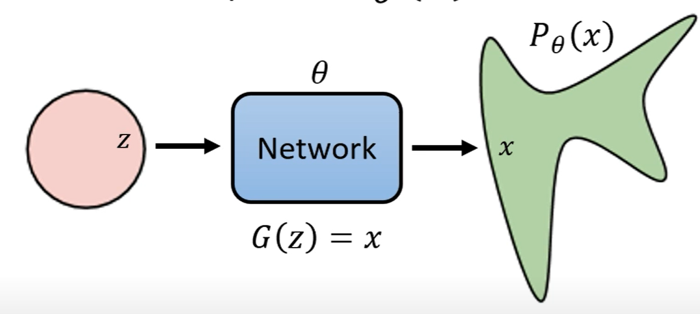
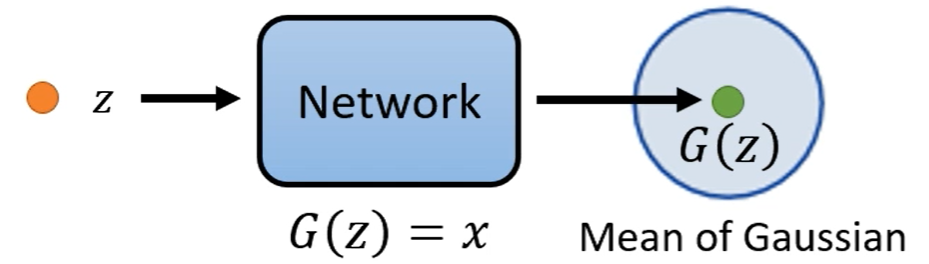

如何计算$P_{\theta}(x)$

$$P_{\theta}(x)=\int_{z}P(z)P_{\theta}(x|z)dz$$

如何确定$P_{\theta}(x|z)$？

在VAE中，将通过网络生成的$G(z)$视作一个高斯分布的均值，$P_{\theta}(x|z)\propto \exp(-||G(z)-x||_2)$

## log P(x)下界

$$\begin{align}
    \log P_{\theta}(x)=\int_{z}q(z|x)\log P(x)dz\\
    =\int_z q(z|x)\log P\left(\frac{P(z,x)}{P(z|x)}\right)dz\\
    =\int_z q(z|x)\log\left(\frac{P(z,x)}{q(z|x)}\frac{q(z|x)}{P(z|x)}\right)dz\\
    \geq\int_z q(z|x)\log\left(\frac{P(z,x)}{q(z|x)}\right)\\dz
\end{align}$$

> VAE中的$q(z|x)$就是**Encoder**