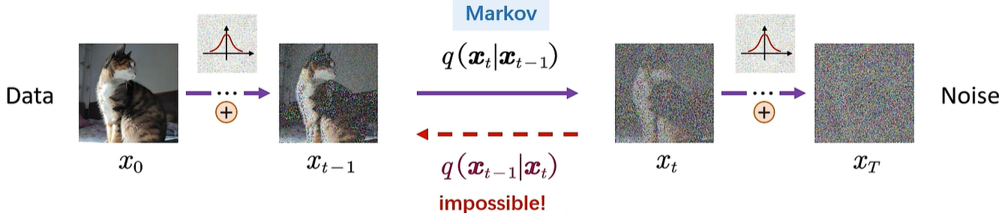

## FDP(Forward Diffusion Process)

$x_t$可以直接根据$x_0$和$t$推导出来

$$x_t=\sqrt{\prod_{i=1}^{t}\alpha_i}x_0+\sqrt{1-\prod_{i=1}^{t}\alpha_i}\epsilon$$

## RDP(Reverse Diffusion Process)

从一个高斯分布进行采样，通过反转过程生成图像

在$x_0$**已知**的情况下，反向生成过程是一个**确定性的过程**

由贝叶斯公式$q(x_{t-1}|x_t)=\frac{q(x_{t}|x_{t-1})q(x_{t-1})}{q(x_t)}$

且已知$q(x_t|x_{t-1},x_0)$和$q(x_{t-1}|x_0)$

则有

$$q(x_{t-1}|x_t,x_0)=\frac{q(x_t|x_{t-1},x_0)q(x_{t-1}|x_0)}{q(x_t|x_0)}\sim N(x_{t-1},\tilde{\mu}(x_t,x_0),\tilde{\sigma}_t I)$$

在上述表达式中，使用了前向过程中的$t$步骤中随机采样的高斯噪声$\epsilon_t$，

我们无法通过$x_t$求得$x_{t-1}$，即$q(x_{t-1}|x_t)$

所以可以通过神经网络$p_{\theta}(x_{t-1}|x_t)$来进行拟合
