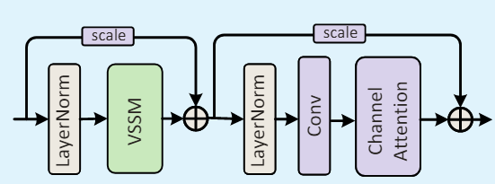
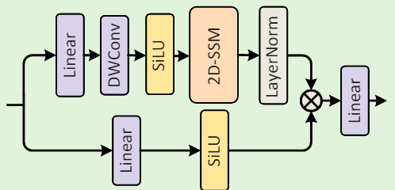
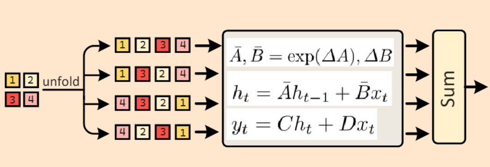

## 结构化状态空间序列模块S4

通过隐式潜在状态$h(t)$映射一维函数或序列$x(t)\to y(t)$

可以表述为线性常微分方程(ODE)

$$\begin{align}
    h'(t)=\text{A}h(t)+\text{B}x(t)\\
    y(t)=\text{C}h(t)+\text{D}x(t)
\end{align}$$

使用零阶保持离散化连续变量$A,B$

$$\begin{align}
    \bar{A}=exp(\Delta \bar{A})=I + \Delta \bar{A} + \frac{\Delta^2 \bar{A}}{2!} + \frac{\Delta^3 \bar{A}}{3!} + \cdots\\
    \bar{B} = (\Delta \text{A})^{-1}(exp(\text{A}-I))\cdot \Delta \text{B}
\end{align}$$

推导

矩阵指数 \( e^{A\Delta} \) 的形式来源于连续时间线性系统的解法。具体来说，对于一个连续时间线性时不变（LTI）系统，其状态方程可以写为：

\[ \dot{h}(t) = Ah(t) + Bu(t), \]

其中 \( h(t) \) 是状态向量，\( u(t) \) 是输入向量，而 \( A \) 和 \( B \) 分别是系统矩阵和输入矩阵。

  矩阵指数的来源

为了理解为什么可以用 \( e^{A\Delta} \) 来表示离散化后的状态转移矩阵，我们需要回顾一下如何求解上述微分方程。假设初始条件为 \( h(0) = h_0 \)，并且输入 \( u(t) = 0 \)，那么状态方程的解为：

\[ h(t) = e^{At}h_0. \]

这里 \( e^{At} \) 是矩阵指数，它定义为无穷级数：

\[ e^{At} = I + At + \frac{(At)^2}{2!} + \frac{(At)^3}{3!} + \cdots, \]

其中 \( I \) 是单位矩阵。这个无穷级数在理论上总是收敛的，并且在数值计算中可以通过截断来近似计算。

  离散化过程

当我们想要将这个连续时间系统转换成离散时间系统时，我们通常会采用零阶保持（ZOH）规则。这意味着在每个采样周期 \( [k\Delta, (k+1)\Delta) \) 内，输入 \( u(t) \) 被固定为 \( u[k] \)。因此，在每个采样周期内，状态方程变为：

\[ \dot{h}(t) = Ah(t) + Bu[k], \quad t \in [k\Delta, (k+1)\Delta). \]

在这个时间段内的解可以写作：

\[ h((k+1)\Delta) = e^{A\Delta}h(k\Delta) + \int_{k\Delta}^{(k+1)\Delta} e^{A((k+1)\Delta - \tau)}Bu[k] d\tau. \]

对于零阶保持的情况，积分项可以简化为：

\[ \int_{k\Delta}^{(k+1)\Delta} e^{A((k+1)\Delta - \tau)}Bu[k] d\tau = (e^{A\Delta} - I)A^{-1}Bu[k]. \]

因此，最终的状态更新公式为：

\[ h[(k+1)\Delta] = e^{A\Delta}h[k\Delta] + (e^{A\Delta} - I)A^{-1}Bu[k]. \]

这正是我们在离散化过程中看到的形式，即：

\[ A_d = e^{A\Delta}, \]
\[ B_d = (e^{A\Delta} - I)A^{-1}B. \]

## RSSB模块

{width=50%}

给定深度特征 $F_{D}^l\in R^{H\times W\times C}$，使用LayerNorm和VSSM捕获空间长期依赖，另外用比例系数s控制跳过连接的信息

$$Z^l=\text{VSSM}(LN(F_{D}^l))+s\cdot F_{D}^l$$

为了避免通道冗余，促进不同通道的表达能力，将通达注意(CA)引入到了RSSB当中，另外在残差连接时使用了另外一个可调节的比例系数s'，最终输出可以表示为

$$F_D^{l+1}=CA(Conv(LN(Z^l))) + s'\cdot Z^l$$

## VSSM模块

{width=50%}

$$\begin{align}
    X_1 = LN(2D-SSM(SiLU(DWconv(Linear(X)))))\\
    X_2 = SiLU(Linear(X))
    X_{out} = Linear(X_1 \cdot X_2)
\end{align}$$

> DWConv：深度卷积，DW完全是在二维平面内进行。卷积核的数量与上一层的通道数相同（通道和卷积核一一对应）
>
> PWconv：与常规卷积运算非常相似，它的卷积核的尺寸为 1×1×M，M为上一层的通道数。所以这里的卷积运算会将上一步的map在深度方向上进行加权组合，生成新的Feature map。有几个卷积核就有几个输出Feature map

## 2D选择扫描模块

{width=50%}

沿四个方向扫描展开为一维序列，然后根据离散状态空间方程捕获每个序列的长期依赖关系，最后将所有序列求和合并