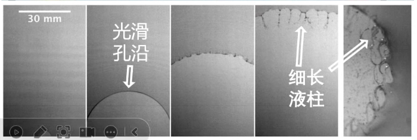

## 题目阐述

[蔻享学术分享会（链接可能失效）](https://www.koushare.com/live/details/34439)

## 基本要素

### 表面张力

液体表面层由于分子作用力的不均匀而产生的张力$F=\sigma L$

### 极小曲面

肥皂膜的表面自由能$E=\sigma S\quad S=\sum_{x_A}^{x_B}y\sqrt{1+y'^2}dx$

### 三相接触线处的接触角

杨氏方程：$cos\theta_e = \frac{\gamma_{SV}-\gamma_{SL}}{\gamma_{LV}}$

接触角的迟滞与前进角后退角有关

界面相对移动速度v与动态接触角$\theta$关系

$$v=\frac{c_{0h}}{2}\frac{\theta}{\theta_e}\left[\frac{1-\frac{\theta^2}{\theta_e^2}}{1+\frac{c_{0h}}{c_{0l}\frac{\theta}{\theta_e}}}\right]$$

$c_{0h}=\gamma\theta_e^3/3\eta l$ 水动力摩擦的特征速度

$c_{0l}=\mu\gamma\theta_e^2$ 局部摩擦相应速度

$\gamma$ 表面张力系数

$\eta$ 液体粘度系数

$\mu^{-1}$ 有效摩擦系数

### 肥皂泡的破裂

在破裂中观察到：

- 破裂初期孔沿是光滑的圆形
- 到了后期会形成细长的液柱

{width=400}

#### 普拉托-瑞利不稳定性

特定波长的表面波振幅增加，直至液柱断裂、形成液滴

### 受力分析和运动机理

- 薄膜前部运动的影响因素
    - 表面张力系数
    - 粘度
    - 液膜厚度
    - 固体材料属性（亲疏水）
- 额外因素
    - 重力的多重影响：导致环间距、液膜厚度不均匀
    - 液膜破碎时环间距的改变（环会晃动）

## 实验装置

捕捉皂膜运动：两个光源，一个正对高摄，一个位于弹簧正上方向下打光

