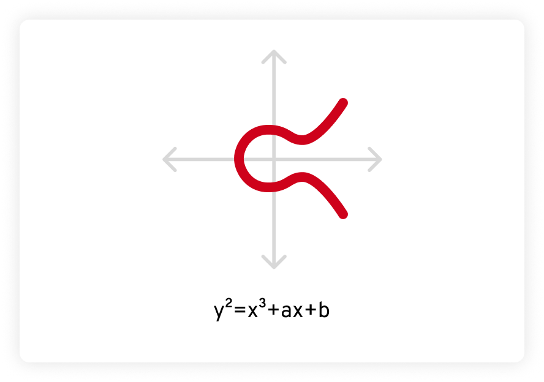
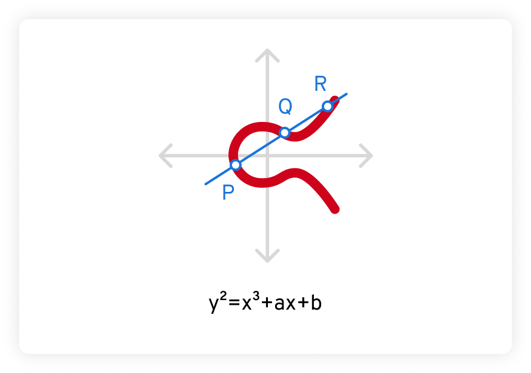

<a href="https://www.keepersecurity.com/blog/zh-hans/2023/06/07/what-is-elliptic-curve-cryptography/" target="_blank">原文链接 keepersecurity</a>

ECC 基于一个称为椭圆曲线的高等数学领域。 椭圆曲线是由方程$y^2=x^3+ax+b$描述的曲线，其中a和b为常量，且该曲线的定义域是**有限域**。绘制出的图形如下：

椭圆曲线具有的一些特殊性质，使它们对于数学家和密码学家而言既有趣又实用。 

首先，椭圆曲线具有水平对称性。位于$x$轴两侧的部分一模一样，就如同镜像。此外，任意不垂直于椭圆曲线的直线与曲线的交点总是**不超过三个**。 在下面的示例中，这些点被标记为$P、Q$和$R$。

## 实数域椭圆曲线的加法定义

**几何描述**：如果椭圆曲线上的3个点位于同一直线上，那么他们的和为0，即$P+Q+R=0$

1. O为加法的单位元，对于椭圆曲线上任何一点$P$，都有$P+O=P$
2. 对于椭圆曲线上的一点$P=(x_p,y_p)$，它的逆元为$-P=(-x_p,-y_p)$，这两个点可以用一条垂直于$x$轴的线连起来并且$P+(-P)=O$
3. 给定两个不同位置点和它们的坐标$P,Q$，分以下两种情形做加法运算：

      - $x_P = x_Q$，此时P与Q互为逆元
      - $x_P \neq x_Q$，计算$P+Q=R$的R，由几何描述可知，作一条过$P$与$Q$的直线，该直线与椭圆曲线相交的点沿$x$轴的对称点便是$R$

## 有限域上的椭圆曲线

椭圆曲线密码体制ECC使用的是变元和系数均为有限域中元素的椭圆曲线，分为有限域$Z_p$的**素曲线**(prime curve)和$GF(2^m)$上构造的曲线

对于$Z_p$上的椭圆曲线，变元和系数来自集合$\{0,1, \dots , p−1\}$，运算为模$p$运算，在$Z_p$上定义方程

$$y^2 \equiv x^3+ax+b (\text{mod} p)$$

> 其中$(x,y)\in Z_p, a,b\in Z_p$，且$4a^3+27b^2\neq 0(\text{mod}p)$以保证该曲线是**非奇异的** （椭圆曲线的非奇异性指的是该曲线在其所有点上都没有重合点或“奇异点”。在代数几何中，奇异点通常指的是曲线的导数为零的点，这意味着曲线在这些点上存在尖点或交叉）

### 有限域上的加法计算

对于$Z_p$上的椭圆曲线的点$P=(x_p,y_p),Q=(x_Q,y_Q)$，它们之间的加法计算如下所示：

$$\begin{align}
    x_R=(\lambda^2-x_P-x_Q) \mod p\\
    y_R=(\lambda(x_P-x_R)-y_P)\mod p
\end{align}$$

其中$\lambda=\begin{cases}(\frac{y_Q-y_P}{x_Q-x_P})\mod p\quad P\neq Q\\(\frac{3x_P^2+a}{2y_p})\mod p\quad P=Q\end{cases}$

### 椭圆曲线加密

椭圆曲线密码体制的建立是基于椭圆曲线上的**离散对数问题的困难性**

考虑$𝑄 = 𝑘𝑃$，其中$𝑄, 𝑃 ∈ 𝐸_𝑝(𝑎, 𝑏)$且$𝑘 < 𝑝$

对给定的$k$和$P$，计算$Q$比较容易，而对给定的$Q$和$P$，计算𝑘则比较困难，这就是椭圆曲线上的离散对数问题。

## 椭圆曲线密码-DH密钥交换

选择大素数$p$以及椭圆曲线方程的参数$a,b$，由此可以定义出椭圆曲线点的集合$E_p(a,b)$，记$E_p(a,b)$的元素个数为$n$

选择一个本原点G，G的阶为$n$，即$n\times G = O$

密钥交换流程：

1. 用户A选择一个小于n的整数$n_A$作为密钥$sk_A$，然后产生公钥$pk_A=n_A\times G$，该公钥是$E_P(a,b)$上的一个点，A将$pk_A$发送给B
2. B仿照A选择自己的私钥$sk_B=n_B$并计算公钥$pk_B$，B将$pk_B$发送给A
3. 此时用户A可以计算密钥$K=n_A\times pk_B$，用户B可以计算密钥$K=n_B\times pk_A$

## 椭圆曲线密码-EIGamal

在使用一个椭圆曲线密码体制时,首先需要将发送的明文𝑚编码为椭圆曲线上的点$𝑃_𝑚 = (𝑥_𝑚, 𝑦_𝑚)$

1. 在椭圆曲线$𝐸_𝑝(𝑎, 𝑏)$上选取阶为𝑛的生成元𝐺。随机选取小于𝑛的整数𝑥作为私钥，计算$𝑄 = 𝑥 \times 𝐺$作为公钥
2. **加密**：随机选取小于𝑛的整数𝑘，计算$𝐶1 = 𝑘𝐺$, $𝐶2 = 𝑃𝑚 + 𝑘𝑄$。密文$𝑐 = (𝐶1, 𝐶2)$。
3. **解密**：计算$𝐶2 − 𝑥𝐶1 = 𝑃𝑚 + 𝑘𝑄 − 𝑥𝑘𝐺 = 𝑃𝑚 + 𝑘𝑥𝐺 − 𝑥𝑘𝐺 = 𝑃𝑚$