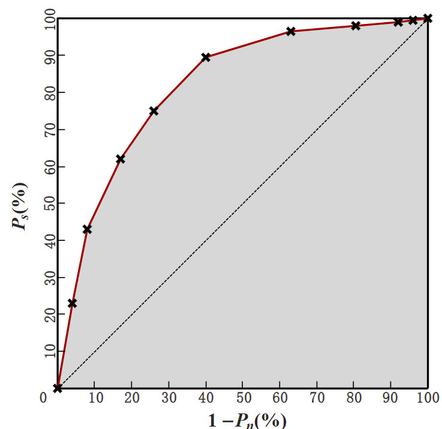
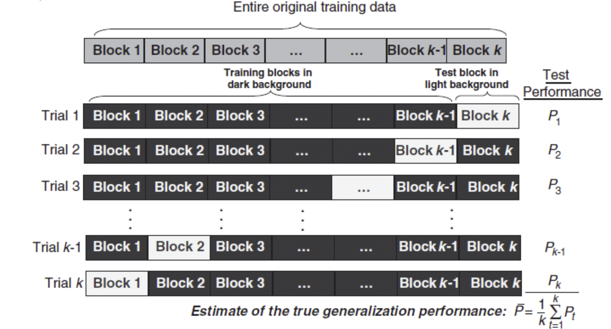
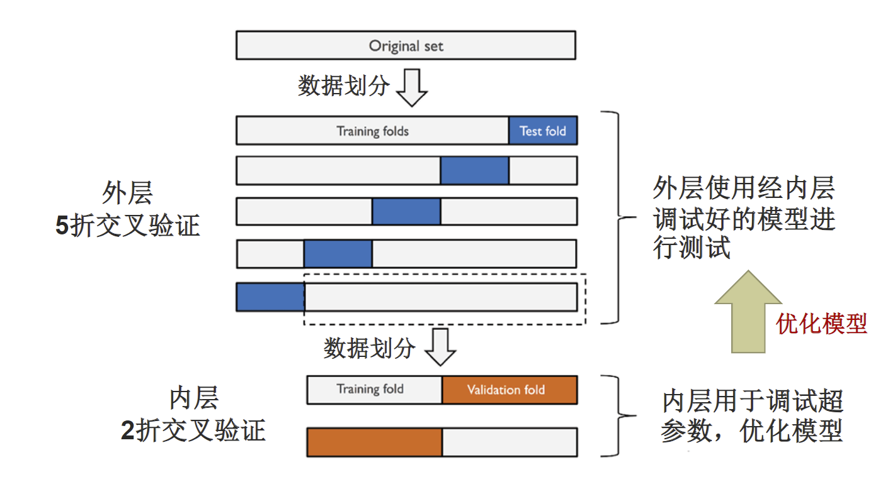
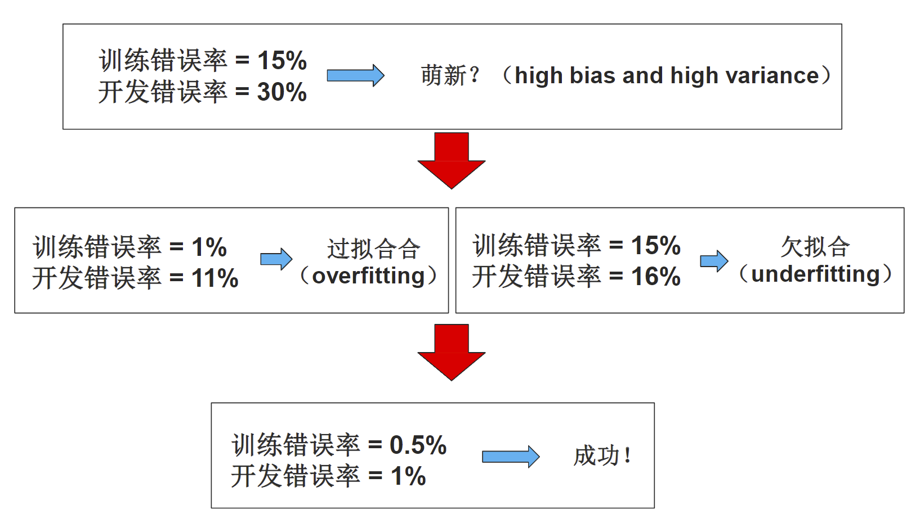

## 数据采集

常用数据预处理

1. 缺失值处理
2. 去除噪声
3. 删除离群点
4. 数据标准化

### 缺失值处理

多数算法无法处理有缺失数据，需要填补数据

> 如果某样本缺失较多数据，或某数据缺失较多样本，可以直接删除该样本或该数据

### 去除噪声

噪声是观测值和真实值之间的随机误差

### 删除离群点

离群点，指**奇异值**，指的是与绝对大多数数据差别极大的少量数据

> 在最近邻方法中奇异值会极大影响结果正确性

常用检测方法：$3\sigma$法

离群点未必要删除，可以对数据做变换（如对数变换），可能消除离群点且不损失信息

### 数据标准化

同[距离分类器-缩放方式](https://amethysttim.github.io/课程笔记/大三上/模式识别/距离分类器/#_9)

## 特征工程

- 适用于数据量少但有较多先验知识和领域知识的应用，模型可解释性和可调节性好

## 样本集的划分

- 训练集：训练模型的参数
- 验证集：检验模型在新数据上的表现，调整选择模型的超参数
- 测试集：最终评估模型的性能

> 必须要保证验证、测试集与实际应用的一致性

## 分类器性能评价

- 评价指标
    - 准确率（accuracy）：分类正确的样本数占总样本数的比例
    - 精确率（precision）：分类为正的样本中，真正的正样本数占所有正样本数的比例
    - 召回率（recall）：分类为正的样本中，真正的正样本数占所有正样本数的比例
    - F1-score：精确率和召回率的调和平均值
    - AUC-ROC：ROC曲线下的面积，越大越好

- 评价方法
    - 交叉验证
    - 两分法：将数据集分为正负两类，分别训练模型，在测试集上评估模型性能，选择最优模型
    - Bootstrap法

评价指标：

- 拒识：只对有把握的样本分类
    - 对m个样本分类，$m_r$个被拒识，$m_e$个被分类错误，则错误率为$P_e\approx \frac{m_e}{m-m_r}$，拒识率$P_r\approx\frac{m_r}{m}$

- 敏感性与特异性（医学相关领域）
    - 敏感性$P_s$：患者被诊断出来的比率
    - 特异性$P_n$：正常人不被误诊的比率
    - 假阳率$1-P_n$
    - ROC曲线，通过实验改变分类器的参数，测试分类器在不同参数下对同一个样本集的敏感性和特异性

{width=300px}

- 召回率与准确率
    - 召回率（查全率）：相关信息被检索出来的比率（与敏感性相似）
    - 准确率：检索出的相关信息中，真正的相关信息的比率

- 调和平均
    - 为了兼顾召回率和准确率，使用二者的调和平均

$$F_1 = \frac{2}{\frac{1}{R}+\frac{1}{P}} = \frac{2RP}{R+P}$$

## 评价方法

1. 两分法：随机将样本集划分为不相交的两个子集，分别用于训练和测试

划分可以随机重复若干次，结果取均值

缺点： 只能使用一部分样本学习分类器，不能充分利用全部样本

2. 交叉验证：将样本集划分为k个互斥子集，其中k-1个用于训练，1个用于测试，重复k次，结果取平均值

优点：每个子集都可以作为一次测试集，可以充分利用全部样本，可以得到更加稳定的模型性能

3. 嵌套交叉验证：数据集分为训练、验证和测试集时，交叉验证可以分为**两次嵌套进行**

4. Bootstrap：从样本集中有放回地抽取n个样本，组成一个Bootstrap样本集A（A中央本可以重复），同样方式获取另一个Bootstrap样本集B，A与B分别作为训练集和测试集，重复k次，结果取平均值

## 误差分析

误差通常由偏差与方差构成

偏差（bias）：训练集上的错误率

方差（variance）：开发集错误与训练集错误的**差值**

总误差(均方误差MSE) = 偏差 + 方差

