## 概率论与统计学习

- 判别式模型：
    - 将x看做特征空间中的点
    - 构建判别函数g(x)来决定x属于哪个类别
    - 关键在于计算x与训练样本$x_i$的内积关系
- 产生式模型
    - 将x看做随机变量
    - 根据x属于各类别$\omega_i$的概率分布$p(x|\omega_i)$来决定其类别
    - 关键在于计算不同类别产生“待识别模式”的概率$P(x|\omega_i)$

### 推理

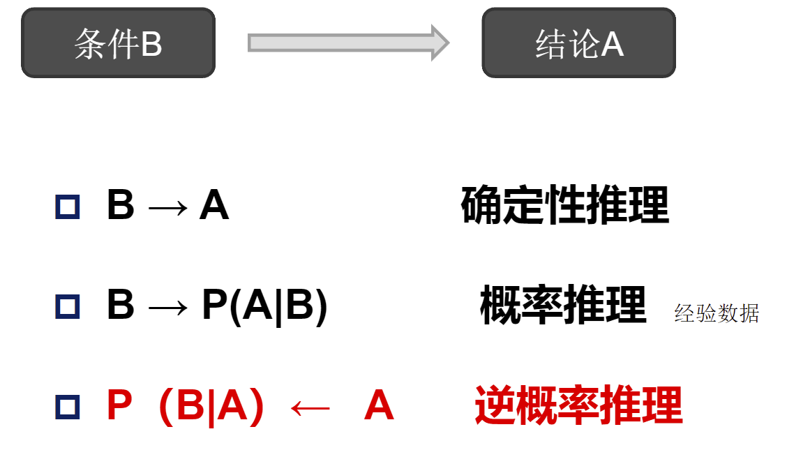{width=500px}

解决这种逆概率推理问题的理论就是贝叶斯理论

### 贝叶斯公式

条件概率公式为：$P(B|A)=\frac{P(AB)}{P(A)}$

$$P(B|A)=\frac{P(A|B)P(B)}{P(A)}$$

> 链式法则：$P(a,b,c)=P(a|(b, c))P(b,c)=P(a|(b,c))*P(b|c)*P(c)$

贝叶斯公式的数学表述为：设试验E的样本空间为$\Omega$，A为E的事件，$B_1,B_2,\cdots,B_C$为$\Omega$的一个划分，且$P(A)>0$，$P(B_i)>0$，那么

$$P(B_i|A)=\frac{P(A|B_i)P(B_i)}{\sum_{j=1}^C P(A|B_j)P(B_j)}=\frac{P(A|B_i)P(B_i)}{P(A)}$$

### 贝叶斯分类器原理

统计分类是依据样本在各个维度上的特征值分布来进行分类决策的模式识别算法，如果把样本真实所属的类别作为条件，样本的特征值作为结果，则有

- 样本真实类别——条件B
- 样本特征值——结果A
- 分类决策——逆推理，最终根据概率的大小来做出分类决策

对于不确定的统计分类，我们已知每个类别的样本取得不同特征向量的概率，现在需要依据某个待识样本的特征向量，计算出该样本属于每一个类的概率

- 先验概率$P(\omega_i)$：
- 类条件概率$P(P(x|\omega_i))$
- 后验概率$P(\omega_i|x)$

则可以得到后验概率为$\frac{P(x|\omega_i)P(\omega_i)}{P(x)}$

### 贝叶斯分类示例

假设目前要确定该照片中的人的性别

{width=300px}

我们可以将“长发”作为一个样本所具有的特征值，我们需要计算的是后验概率$P(男|长发)$和$P(女|长发)$

已知先验概率$P(男)=0.5,P(女)=0.5$

类条件概率：

- $P(长发|男)=0.05$
- $P(长发|女)=0.7$
- 假设$P(男)=0.5,P(女)=0.5$

那么我们得到后验概率$P(男|长发)=\frac{0.05*0.5}{0.05*0.5+0.7*0.5}=0.067$，$P(女|长发)=\frac{0.7*0.5}{0.05*0.5+0.7*0.5}=0.933$

> 无论选择哪一类都有可能犯错，在各类别先验概率不相等时，后验概率也会发生较大变化

### 贝叶斯分类器的特点

1. 先验概率**必须已知**
2. 以新获得的信息对先验概率进行修正
3. 分类决策**存在错误率**

## 贝叶斯决策理论

### 基于最小错误率的贝叶斯决策

#### 两类问题的错误率

观察特征x做出判别的错误率

$$P(error|x)=\begin{cases}
    P(\omega_1|x)&判定\omega_2\\
    P(\omega_2|x)&判定\omega_1
\end{cases}$$

选择其中错误率最小的作为决策

#### 多类问题的最小错误率

判断x属于$\omega_i$的错误率

$$P(error|x)=\sum_{j\neq i}^C P(\omega_j|x)=1-P(\omega_i|x)$$

判断准则为$i=\argmin_{1\leq j\leq c}P(\omega_j|x)$

#### 贝叶斯最小错误率准则

$$g_j(x)=p(x|\omega_j)P(\omega_j)$$

有$i=\argmin_{1\leq j\leq c}g_j(x)$，则$x\in \omega_i$

### 基于最小风险的贝叶斯决策

判断某人是正常(ω正)还是患者(ω患),将出现以下情况

确定决策风险最小：

做出正常判决的风险：$R_正(x)=\lambda_{正\to 正}P(\omega_正|x)+\lambda_{患\to 正}P(\omega_患|x)$

做出患病判决的风险：$R_患(x)=\lambda_{正\to 患}P(\omega_正|x)+\lambda_{患\to 患}P(\omega_患|x)$

> 计算各类决策风险后，选择风险最小的作为决策

#### 最小平均风险准则的贝叶斯分类器

有c个类别$\omega_1,\omega_2,\cdots,\omega_c$，将$\omega_i$类样本判别为$\omega_j$类的代价为$\lambda_{ij}$

则将未知模式判别为$\omega_j$的平均风险为

$$\gamma_j(x)=\sum_{i=1}^c\lambda_{ij}P(x|\omega_i)P(\omega_i)$$

构造判别函数$g_j(x)=-\gamma_j(x)$

#### 示例

决策问题：

- 判别类别$\{\omega_1,\omega_2,\dots,\omega_c\}$，正常人、癌症早期、癌症晚期
- 治疗行为$\{\alpha_1,\alpha_2,\dots,\alpha_c\}$，不治疗、保守治疗、手术、化疗

风险函数：在类别状态$\omega_j$时，采取行动$\alpha_i$的平均风险为

$$\lambda_{手术，癌症早期}=\lambda(\alpha_{手术}|\omega_{癌症早期})$$

条件风险：观察到某人体特征x，采取行动$\alpha_{手术}$的损失期望为

$$\begin{align}
    R(\alpha_{手术}|x)=\lambda(\alpha_{手术}|\omega_{正常})P(\omega_{正常}|x)\\
    +\lambda(\alpha_{手术}|\omega_{癌症早期})P(\omega_{癌症早期}|x)\\
    +\lambda(\alpha_{手术}|\omega_{癌症晚期})P(\omega_{癌症晚期}|x)
\end{align}$$

贝叶斯决策论的基本思想是**使统计意义上由于误判而蒙受的损失最小**

贝叶斯风险：对所有x做出决策时，均进行条件风险最小化，总的期望风险R最小，即贝叶斯风险，记作$R*$

#### 贝叶斯分类中的类条件概率

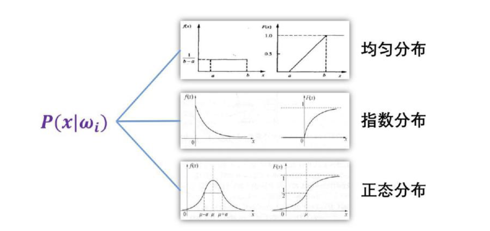

### 朴素贝叶斯分类器

解决**多特征少样本**贝叶斯分类的一种有效办法是采用朴素贝叶斯分类器

朴素贝叶斯的一个基本假设是所有特征在类别一致的条件下是**相互独立**的

$$p(x|\omega_i)=p(x_1,\dots, x_d|\omega_i)=\prod_{j=1}^d p(x_j|\omega_i)$$

## 估计

<figure markdown>
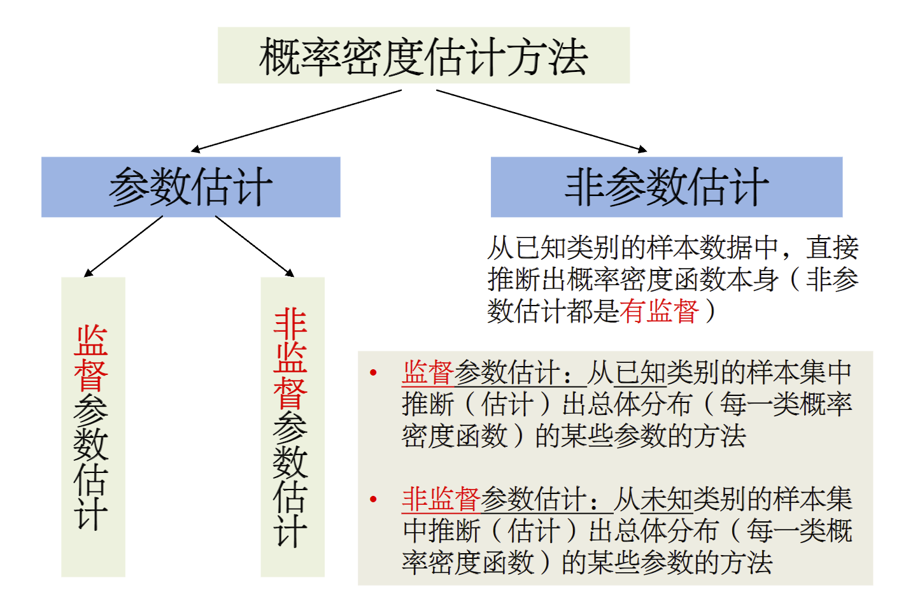
</figure>

### 类的先验概率估计

- 相对比较容易
    - 依靠经验
    - 用训练数据中各类出现的频率来估计

### 类条件概率估计

可以表述为已知c个类别的训练样本集合$D_1,D_2,\cdots,D_c$，估计类条件概率$P(x|\omega_i)$

- 非常困难
    - 概率密度函数包含了一个随机变量的全部信息
    - 概率密度函数可以是满足下面条件的任何函数

$$p(x)\geq 0, \quad \int_{-\infty}^{\infty}p(x)dx=1$$

### 概率密度的估计思路

1. 参数估计：根据对问题的一般性认识，假设随机变量服从某种分布，分布函数的参数通过训练数据来估计（如，假设x服从正态分布，要估计的参数就是$\mu、\Sigma$）
2. 非参数估计：不用模型，只用训练数据本身对概率密度进行估计

## 非参数估计

现在已知训练样本的特征值分布，如何利用直方图统计来计算样本x的概率密度$p(x)$？

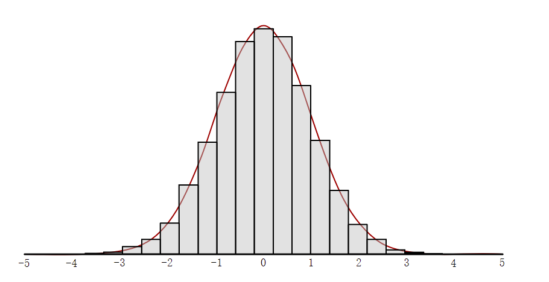

假设R是d维空间中包含样本x的一个小区域，n个训练样本有k个落入R的范围内，则有

$$P(x\in R)\approx \frac{k}{n}$$

假设R中每一点的概率密度是相等的，则有$P(x\in R)=\int_{R}p(x)dx=p(x)\times Vol$，即

$$p_n(x)=\frac{k_n/n}{V_n}$$

> 非参数估计相当于使用R区域的平均性质来作为一点x的估计，是一种数据的平滑

### 区域选定

当n固定时，V的大小对估计的效果影响很大：过大则平滑过多，不够精确；过小则可能导致在此区域内无样本点，k=0。

1. Parzen窗法：区域体积V是样本数n的函数，如：$V_n=\frac{1}{\sqrt{n}}$（显式估计类条件概率密度）
2. K-近邻法：落在区域内的样本数k是总样本数n的函数，如$k_n=\sqrt{n}$（估计后验概率，再计算条件概率密度）

#### Parzen窗方法

定义窗函数

$$\phi(x)=\begin{cases}
    1&|x_j|\leq 1/2\\
    0&else
\end{cases}$$

<figure markdown>

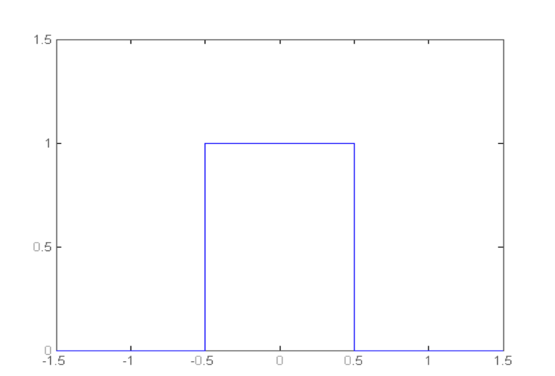{width=300px}

</figure>

$$\phi(\frac{x-x_i}{h_n})=\begin{cases}
    1&|x_j-x_{ij}|\leq h_n/2& j=1,\dots,d\\
    0&else
\end{cases}$$

> $h_n$为窗的宽度

则超立方体中的样本数$k_n=\sum_{i=1}^n\phi(\frac{x_i-x}{h_n})\quad V_n=h^d_n$

##### 识别方法

根据每个类别训练样本计算待识别样本x的类条件概率密度

$$p_n(x|\omega_i)=\frac{1}{n_i}\sum_{j=1}^{n_i}\frac{1}{V_n}\phi\left(\frac{x-x_j^i}{h}\right)$$

#### 高斯窗函数

方形的窗函数是不连续的，在有限样本条件下得到的概率密度是阶梯型的函数，存在很多不连续点

$$\phi(\frac{x-x_i}{h_n})=\frac{1}{(h_n\sqrt{2\pi})}\exp\left(-\frac{(x-x_i)^2}{2h_n^2}\right)$$

> 高斯窗函数是连续的，在有限样本条件下得到的概率密度是高斯分布的函数，不存在不连续点

#### K近邻估计

将一个体积为V的区域放到待识别样本x周围，包含k个训练样本点，其中$k_i$属于$\omega_i$类，总的训练样本数为n，则有：$p_n(x,\omega_i)=\frac{k_i}{nV}$

##### 识别方法

计算与x距离最小的前k个样本，统计其中包含的各类别数目$k_i$，有$class=\argmax_{1\leq i\leq c}k_i$

## 参数估计

预先假设每一个类别的**概率密度函数形式已知**，具体参数未知

1. 最大似然估计（MLE）
2. 贝叶斯估计

### 最大似然估计

假设类条件概率密度形式已知，参数可以表示为参数矢量θ

为了强调类条件概率密度依赖于$\theta$，记作$p(x|\omega_i,\theta_i)$或者$p(x|\theta)$

最大似然估计的目标是通过求解合适的参数$\theta$，使得样本数据出现的概率最大（最大程度解释观测到的数据）

#### 似然函数

问题：已知样本集D，包含n个样本$x_1,x_2,\cdots,x_n$，每个样本根据分布独立抽取，求似然函数$L(\theta|D)$

假设独立同分布，样本集出现的概率为

$$L(\theta)=p(D|\theta)=p(x_1,x_2,\cdots,x_n|\theta)=\prod_{i=1}^n p(x_i|\theta)$$

定义$l(\theta)=\ln p(D|\theta)=\sum_{i=1}^n\ln p(x_i|\theta)$

#### 最大似然估计

寻找一个最优矢量$\hat{\theta}$，使得似然函数$l(\theta)$最大

即$\nabla_{\theta}l=0$

#### 示例

假设样本集$D=\{x_1,\dots,x_n\}$，满足均值为$\mu$，方差为$\sigma^2$的正态分布，推导单变量高斯正态分布参数的最大似然估计

$p(x)=\frac{1}{\sqrt{2\pi}\sigma}\exp\left(-\frac{(x-\mu)^2}{2\sigma^2}\right)$

似然函数为

有$l(\theta)=\sum_{i=1}^n\ln p(x_i|\theta)=\sum_{i=1}^n\ln\frac{1}{\sqrt{2\pi}\sigma}\exp\left(-\frac{(x_i-\mu)^2}{2\sigma^2}\right)$

$$\frac{\partial l(\theta)}{\partial \mu}=\frac{1}{\sigma^2}\sum_{i=1}^n(x_i-\mu)=\frac{1}{\sigma^2}\sum_{i=1}^nx_i-\frac{n}{\sigma^2}\mu=0$$

得$\mu=\frac{1}{n}\sum_{i=1}^nx_i$，$\sigma^2=\frac{1}{n}\sum_{i=1}^n(x_i-\mu)^2$

### 贝叶斯估计

#### 过程

- 已知独立同分布训练样本集D
- 已知类条件概率密度函数$p(x|\theta)$的形式，但是$\theta$未知
- 已知参数$\theta$的先验概率密度函数$p(\theta)$

求在已知数据集$D$条件下，类条件概率密度函数$p(x|D)$

1. 确定$\theta$的先验分布
2. 计算样本联合分布$p(D|\theta)$
3. 利用贝叶斯公式求$\theta$的后验分布$p(\theta|D)=\frac{p(D|\theta)p(\theta)}{p(D)}$
4. 求出贝叶斯估计值$\hat{\theta}=\int_{\theta}\theta p(\theta|D)d\theta$

$\theta$是一个随机变量，$\theta$以一定的概率分布$p(\theta)$所有可能的值

- 学习过程：估计$p(\theta|D)$
- 计算过程：计算$p(x|D)$

根据参数$\theta$的后验分布，计算x的概率密度函数

> 贝叶斯估计的本质：通过贝叶斯决策得到参数θ的最优估计，使得总期望风险最小

$$\begin{align}
    p(x|D)=\int p(x,\theta|D)d\theta\\
    =\int p(x|\theta,D)p(\theta|D)d\theta\\
    =\int p(x|\theta)p(\theta|D)d\theta
\end{align}$$

#### 示例

已知概率密度函数满足正态分布，其中方差$\sigma^2$已知，均值$\mu$未知，假设$\mu$的先验概率满足正态分布，即

$$p(x|\mu)\sim N(\mu,\sigma^2)\quad p(\mu)\sim N(\mu_0,\sigma_0^2)$$

估计x的概率密度函数

$$p(x|D)=\int p(x|\mu)p(\mu|D)d\mu$$

> 其中$p(\mu |D)=\frac{p(D|\mu)p(\mu)}{\int p(D|\mu)p(\mu)d\mu}$

### 最大似然估计与贝叶斯估计的差别

- 最大似然估计：$\theta$是一个确定未知矢量
- 贝叶斯估计：$\theta$是一个随机变量，$\theta$以一定的概率分布$p(\theta)$所有可能的值

## 混合高斯模型(GMM)

复杂的概率密度模型：可以由多个简单的密度函数混合而成

$$p(x|\theta)=\sum_{k=1}^K a_kp_k(x|\theta_k)\quad a_k>0,\sum_{k=1}^K a_k=1$$

高斯混合模型（GMM）：由多个高斯密度函数混合，用于**逼近复杂的概率密度**

$$p(x)=\sum_{k=1}^Ka_kN(x;\mu_k,\Sigma_k)$$

### 高斯混合模型参数估计

1. 使用最大似然法估计。可写出GMM的对数似然函数l(θ) 并求出l(θ) 关于θ中每一个参数
的偏导数；但直接令偏导数等于0求极值会导致一个复杂多元超越方程组，很难得到解析解
2. 使用**期望最大化算法**(EM)估计

参数估计中存在两组未知信息

1. GMM的参数$\theta$
2. 每个样本$x_i$产生自哪一个分量高斯分布？用$Y=\{y_1,\dots,y_n\}$表示这一组待估计信息，其中$y_i$表示第i个样本由第$y_i$个分量高斯分布生成

<figure markdown>
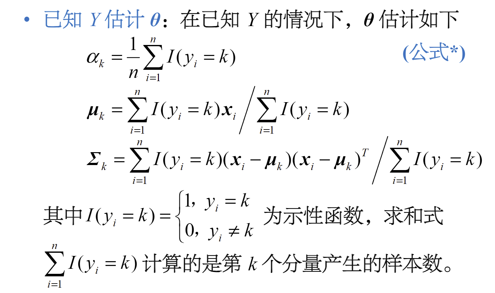{width=500px}

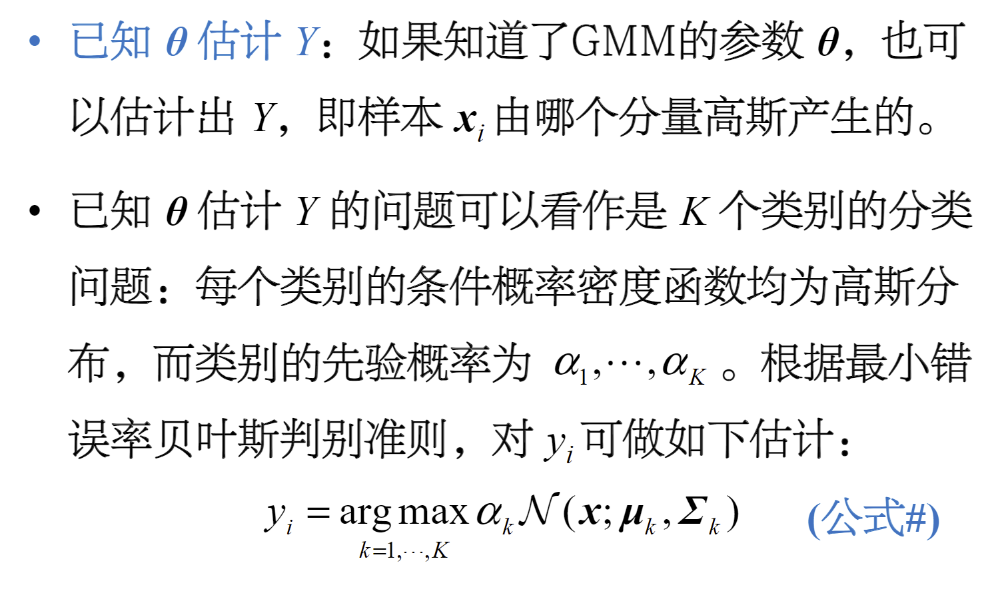{width=500px}

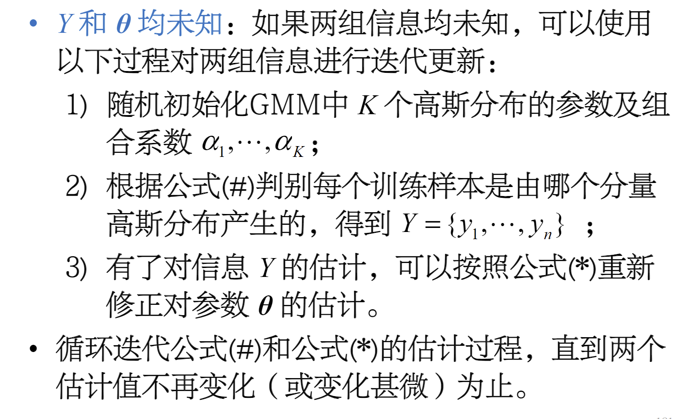{width=500px}

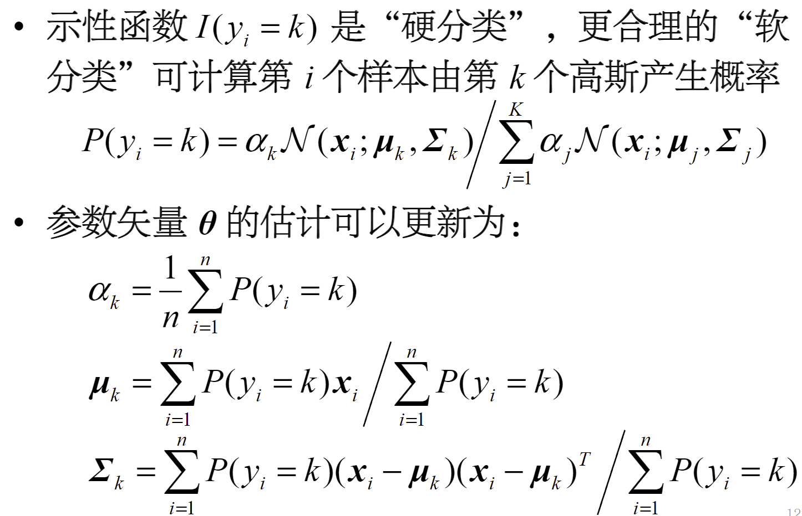{width=500px}
</figure>

## 隐马尔可夫模型(HMM)

### 以序列形式出现的模式

在很多问题中，模式以序列形式出现的，例如视频、语音、基因序列等。如将这序列信号采用特征矢量的方式描述，会损失信号的先后次序变化信息。

<figure markdown>
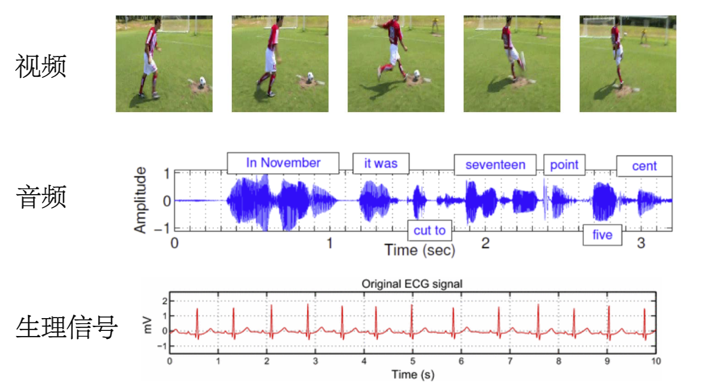{width=500px}
</figure>

以序列出现的模式可以表示为

$$V^T=\{v_1,v_2,\cdots,v_T\}$$

> 其中T表示序列长度，序列中的元素$v_i$称为时刻i的观察值

如果希望采用贝叶斯分类器识别以序列形式出现的模式，就需要构建**描述序列的概率密度函数**，计算每个类别产生出需要识别序列的概率密度

### 马尔科夫模型

由若干状态构成，模型当前状态只依赖于前一时刻的状态，与之后的状态无关

马尔科夫过程：由马尔科夫模型所产生的一类状态转移过程

### 离散时间有限状态一阶马尔可夫模型

一阶马尔科夫模型由**M个状态**$W=\{w_1,w_2,\cdots,w_M\}$构成，在每个时刻t，模型处于某个状态$w(t)\in W$，经过**T个时刻**，产生出一个长度为T的状态序列$W^T=w(1),w(2),\cdots,w(T)$

- 状态转移概率$a_{ij}$，模型在t-1时刻状态为$w_i$，而在时刻t状态为$w_j$的概率

$$a_{ij}=P(w(t)=w_j|w(t-1)=w_i)$$

- 一阶马尔科夫模型中，$a_{ij}$完全由t-1时刻的状态决定，而与时刻t无关

定义模型初始于状态$w_i$的概率为$\pi_i$

完整的一阶马尔科夫模型可以用参数$\theta=(\pi,\{a_{ij}\})$表示

$$\pi=\pi_1,\dots \pi_M,\quad A=\left[\begin{matrix}
    a_{11} & a_{12} & \cdots & a_{1M}\\
    a_{21} & a_{22} & \cdots & a_{2M}\\
    \vdots & \vdots & \ddots & \vdots\\
    a_{M1} & a_{M2} & \cdots & a_{MM}
\end{matrix}\right]$$

且参数应该满足$\sum_{i=1}^M\pi_i=1,\quad, \sum_{j=1}^Ma_{ij}=1$

模型输出状态序列的概率可以由**初始状态概率与各次状态转移概率相乘**得到

<figure markdown>
{width=500px}
</figure>

### 隐马尔可夫模型

HMM的内部是一个马尔科夫模型，每一时刻都依据概率发生状态转移。但状态转移的过程是**观察不到的**，所能够观察到的是每一时刻模型根据所处的状态**产生**的一个**“观察值”序列**$V^T=v(1),v(2),\cdots,v(T)$

HMM是一个双重随机过程，由两个随机过程组成：

1. 隐状态序列：由初始状态$w_i$和状态转移概率$\{a_{ij}\}$决定，$W^T=w(1),w(2),\cdots,w(T)$
2. 观察值序列：由状态$w_i$和观察概率$\{b_{ij}\}$决定，$V^T=v(1),v(2),\cdots,v(T)$

> 隐状态输出的观察值可以是离散值，连续值，也可以是一个矢量

以离散HMM为例，隐状态可能输出的观察集合为$v(t)\in V=\{v_1,v_2,\cdots,v_K\}$，第i个状态输出第j个观察值的概率为$b_{ij}=P(v_j|w_i)$

HMM的完整参数为$\theta=(\pi,\{a_{ij}\},\{b_{ij}\})$，其中$\{b_{ij}\}$为$M\times K$的矩阵，表示第i个状态输出第j个观察值的条件概率

### HMM的三个基本问题

1. 估值问题：已知一个HMM，其参数已知，计算模型输出特定观察序列$V^T$的概率
2. 解码问题：已知一个HMM，其参数已知，计算模型最有可能输出观察序列$V^T$的隐状态转移序列$W^{T}$
3. 学习问题：已知一个观察序列$V^T$，估计HMM的参数$\theta$

### 估值问题

一个HMM产生观察序列$V^T$可由下式计算

$$\begin{align*}
    P(V^T|\theta)=\sum_{r=1}^{r_{max}}P(V^T,W_r^T|\theta)\\
    =\sum_{r=1}^{r_{max}}P(V^T|W_r^T,\theta)P(W_r^T|\theta)\\
    \\
    P(V^T|W_r^T,\theta)=\prod_{t=1}^T b_{w_r(t)v(t)}\\
    P(W^T_r|\theta)=\pi_{w_r(1)}\prod_{t=1}^{T-1}a_{w_r(t)w_r(t+1)}
\end{align*}$$

> $r_{max}$表示HMM所有可能的状态转移序列数

#### 前向算法

估值问题的计算复杂度为$O(M^T ×T)$。当状态数M较多，序列的长度T较长时，计算量大。随着序列长度的增加，计算复杂度呈指数增长

事实上，计算过程中有很多重复项只需要计算1 次即可，这样就可以有效地减小计算量

在每个节点上定义$\alpha_i(t)$值，表示HMM在第t时刻处于第i个状态，并且输出序列是$v(1),\dots, v(t)$的概率

<figure markdown>
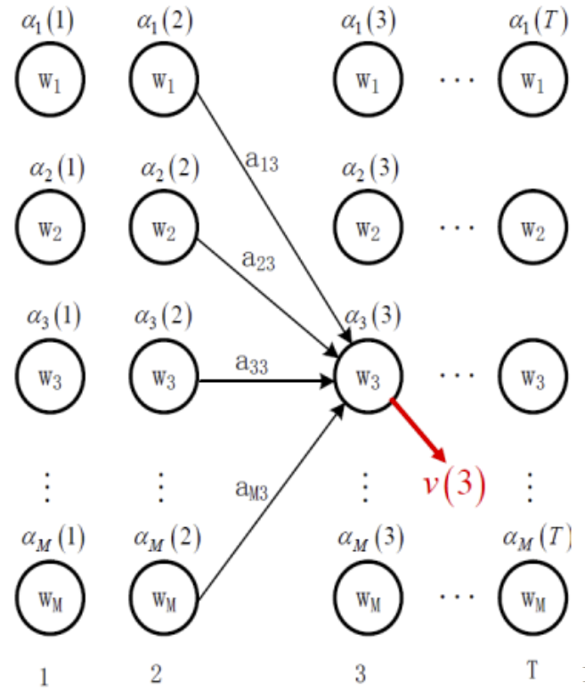{width=300px}
</figure>

> $\alpha_i(1)=\pi_ib_{iv(1)}$
> $\alpha_i(2)=\left[\sum_{j=1}^M\alpha_j(1)a_{ji}\right]b_{iv(2)}$ 
> $\alpha_i(3)=\left[\sum_{j=1}^M\alpha_j(2)a_{ji}\right]b_{iv(3)}$ 
> $\vdots$

那么根据以上迭代算式，得到最终的$P(V^T|\theta)=\sum_{i=1}^M\alpha_i(T)$

### 解码问题

一个例子：如果知道此人连续**三天的活动**分别为**散步、做家务和购物**，推测这三天中该城市最有可能的**天气状况**

> 解码问题实际上关心的是如何根据模型输出的结果（观察序列）来推测产生出该结果的内部机理（状态转移序列）的问题

需要求解如下优化问题

$$W*=\argmax_{W^T} P(W^T|V^T,\theta)$$

根据贝叶斯公式：$P(W^T|V^T,\theta)\frac{P(V^T|W^T,\theta)P(W^T|\theta)}{P(V^T|\theta)}$

解码问题可以被转化为求解如下优化问题

$$\argmax_{W^T} P(V^T|W_r^T,\theta)P(W_r^T|\theta)$$

#### Viterbi算法

在每个节点上定义$\delta_i(t)$值，表示HMM在第t时刻处于第i个状态，并且输出序列是$v(1),\dots, v(t)$最优路径的概率值

<figure markdown>
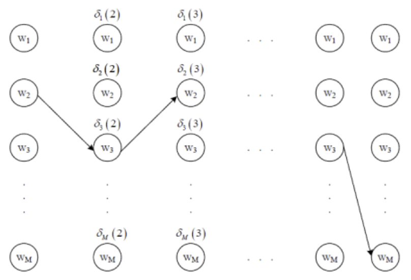{width=300px}
</figure>

> $\delta_i(1)=\pi_i b_{iv(1)}$ 
> $\delta_i(t+1)=\max_{1\leq j\leq M}\left[\delta_j(t)a_{ji}b_{iv(t+1)}\right]$ 

### 学习问题

如何根据一组训练模式的观察序列集和V学习HMM参数$\theta$

HMM描述的是观察序列发生的概率，所以对其的学习仍然是一个**参数估计问题**，采用最大似然估计方法求解

$$\theta*=\argmax_{\theta} P(V|\theta)$$

> 由于状态转移序列是隐含的，所以HMM的参数需要采用EM算法进行迭代估计

#### Baum-Welch算法

也称为前向后向算法，先设定一个转移概率的初值，然后获得对该初值的一个修正，反复迭代直至收敛

为计算$\theta=(\pi,A,B)$，定义变量$\alpha,\beta,\gamma$

- $\alpha$：$\alpha_i(t-1)$表示第t-1时刻HMM处于状态$w_i$的观察序列，并在$1\to t-1$期间产生出观察序列$V^{1\to t-1}$的概率
- $\beta$：$\beta_j(t)$表示第t时刻HMM处于状态$w_j$的观察序列，并在$t+1\to T$期间产生出观察序列$V^{t+1\to T}$的概率

- $\alpha$值的计算同前向算法，由第一列向最后一列迭代

$$\begin{align*}
    \alpha_i(1)=\pi_i b_{iv(1)}\\
    \alpha_t(t+1)=\left[\sum_{j=1}^M\alpha_j(t)a_{ji}\right]b_{iv(t+1)}
\end{align*}$$

- $\beta$值的计算与$\alpha$值类似，但是是由最后一列向第一列迭代

$$\begin{align*}
    \beta_j(T)=1\\
    \beta_j(t)=\sum_{i=1}^M\beta_i(t+1)a_{ij}b_{jv(t+1)}
\end{align*}$$

- $\gamma$值表示相邻两列任意两个节点之间：$\gamma_{ij}(t)$表示当HMM输出观察序列$V^T$时，在$t-1$时刻处于$w_i$，在$t$时刻处于$w_j$的概率

$$\begin{align*}
    \gamma_{ij}(t)=P[w(t-1)=w_i,w(t)=w_j|V^T,\theta]\\
    =\frac{P[w(t-1)=w_i,w(t)=w_j,V^T|\theta]}{P(V^T|\theta)}\\
    =\frac{\alpha_i(t-1)a_{ij}b_{jv(t)}\beta_j(t)}{P(V^T|\theta)}
\end{align*}$$

<figure markdown>
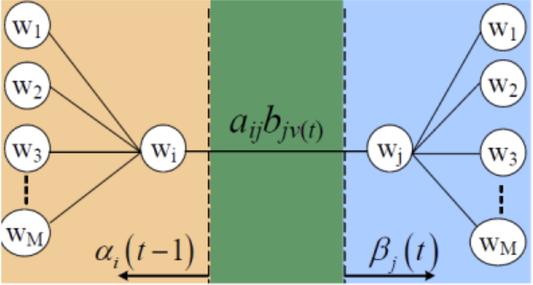{width=400px}
</figure>

- 当t=1，有$\gamma_j(1)=\frac{\pi_jb_{jv(1)}\beta_j(1)}{P(V^T|\theta)}$

- 有了$\gamma$值，就可以计算$A$、$B$和$\pi$的值

$$\pi_i=P[w(1)=w_i|V^T,\theta]=\gamma_i(1)$$

- 从1到T时刻，HMM由状态$w_i$转移到状态$w_j$的期望次数为$\sum_{t=2}^T\gamma_{ij}(t)$，而由状态$w_i$转移到任意一个状态的期望次数$\sum_{t=2}^T\sum_{k=1}^M\gamma_{ik}(t)$，$a_{ij}$的迭代公式为

$$a_{ij}=\frac{\sum_{t=2}^T\gamma_{ij}(t)}{\sum_{t=2}^T\sum_{k=1}^M\gamma_{ik}(t)}$$

- 在1到T时刻，HMM在状态$w_i$输出观察值$v_k$的期望次数为$\sum_{t=1,v(t)=v_k}^T\sum_{l=1}^M\gamma_{li}(t)$，而在状态$w_i$输出任意一个观察值的期望次数$\sum_{t=1}^T\sum_{l=1}^M\gamma_{li}(t)$，$b_{ij}$的迭代公式为

$$b_{ij}=\frac{\sum_{t=1,v(t)=v_k}^T\sum_{l=1}^M\gamma_{li}(t)}{\sum_{t=1}^T\sum_{l=1}^M\gamma_{li}(t)}$$

<figure markdown>
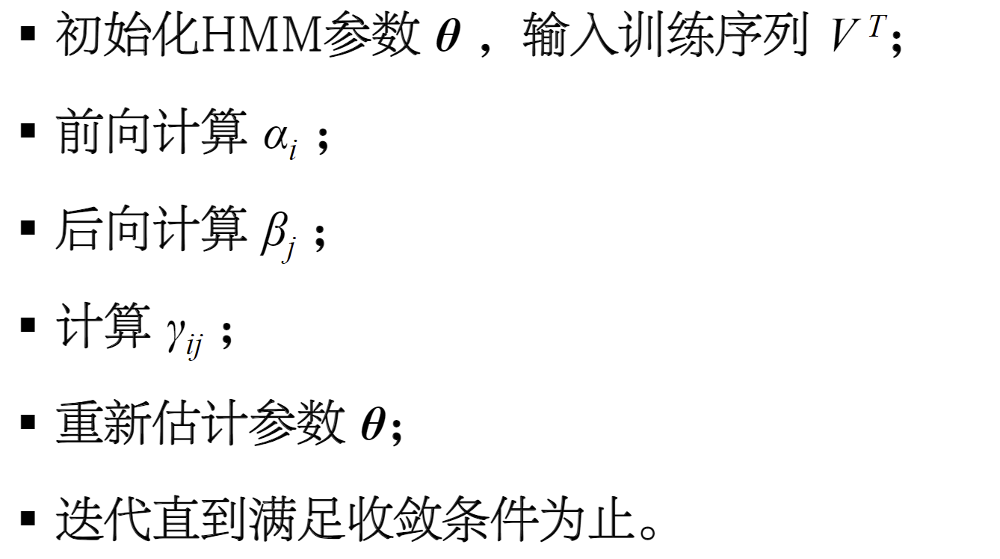{width=400px}
</figure>

### HMM的其他问题

- 连续HMM：在观察序列中每个观察值是一个特征矢量，相应的模型中输出概率就需要用一个概率密度函数描述，其函数形式需要假设，通常使用GMM
- 模型的拓扑结构

{width=500px}