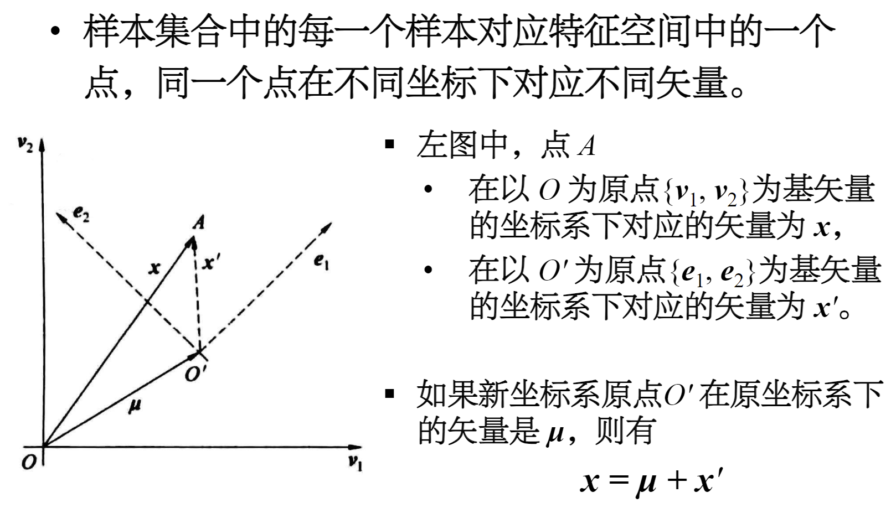
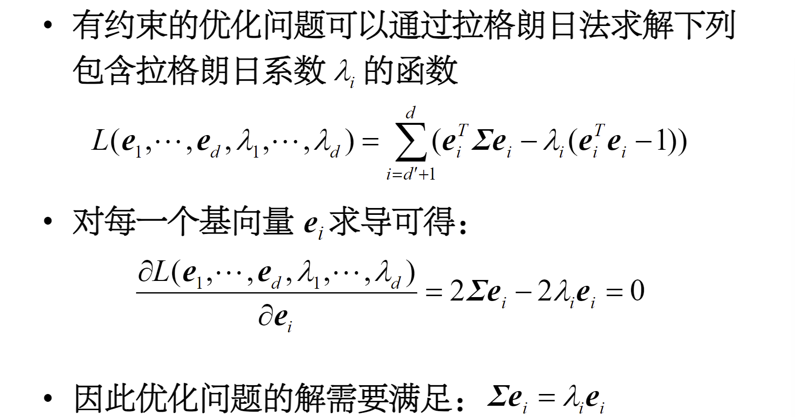

## 特征提取

特征选择：从原始的d维数据中选择d'个特征使得某种类别可分性判据最优

特征提取：将原始特征经过某种变换$y_i=f_i(x)$得到可极大限度保留原特征信息的少量新特征

## 主成分分析(PCA)

主要思想：寻找到数据的**主轴方向**，由主轴构成一个新的坐标系，然后数据由原坐标向新坐标系**投影**

> 直角坐标系下，矢量可以表示为基矢量的线性组合

新坐标系下，矢量x'的元素可以由原坐标系下的矢量$\vec{x}$和$\mu$和基矢量计算得到

$$a_i=e_i^T(x-\mu)\quad i=1,2,\dots,d$$

如果只选择$d'<d$个特征，然后用保留的特征恢复原坐标系下的d维特征矢量

$$\hat{x}=\mu+\sum_{i=1}^{d'}a_ie_i$$

显然存在误差，误差大小与新坐标的位置、基矢量的方向以及保留的特征有关

### 寻找最优基矢量

用$a_{ki}$表示第k个样本在新坐标系下第i维的特征，可得$x_k-\hat{x_k}=\sum_{i=d'+1}^da_{ki}e_i$

优化问题变为

$$\begin{align}
    \min_{e_1,\dots,e_d}J(e_1,\dots,e_d)=\frac{1}{n}\sum_{k=1}^n||\sum_{i=d'+1}^da_{ki}e_i||^2\\
    =\frac{1}{n}\sum_{k=1}^n\sum_{i=d'+1}^d a_{ki}^2\\
\end{align}$$

又因为$a_{ki}=e^T(x_k-\mu)=[e_i^T(x_k-\mu)]^T$

得到

$$\begin{align}
    \min_{e_1,\dots,e_d}J(e_1,\dots,e_d)=\sum_{i=d'+1}^{d}e_i^T\left[\frac{1}{n}\sum_{k=1}^n(x_k-\mu)(x_k-\mu)^T\right]e_i\\
    =\sum_{i=d'+1}^{d}e_i^T\Sigma e_i
\end{align}$$

> 约束为$||e_i||^2=1,i=1,2,\dots,d$

> 使得$\Sigma e_i=\lambda_ie_i$成立的$\lambda_i$与$e_i$分别为$\Sigma$的**特征值**与**特征向量**

如果希望将一个样本集 D 的维度在新坐标下降低，可以将新坐标系原点放在样本集 D 均值位置，以集合 D 的协方差矩阵的特征矢量作为基矢量，可以保证只用保留的 dʹ 维特征恢复原矢量的时候均方误差最小

### 主成分分析算法

1. 输入：样本集合D，计算均值矢量$\mu$，协方差矩阵$\Sigma$
2. 计算协方差矩阵的特征值和特征向量，按照特征值由大到小排序
3. 选择前d'个特征矢量作为列矢量构成矩阵$E=(e_1\quad e_2\quad \cdots\quad e_d')$
4. d维特征矢量$\vec{x}$可以转换为d'维特征矢量$\vec{x}'$
5. 由降维后的矢量$\vec{x}'$恢复原始量x

$$\hat{x}=Ex'+\mu$$

### 示例

## 基于Fisher准则的可分性分析

