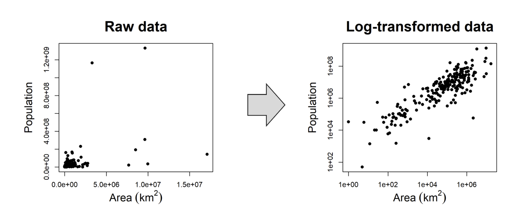
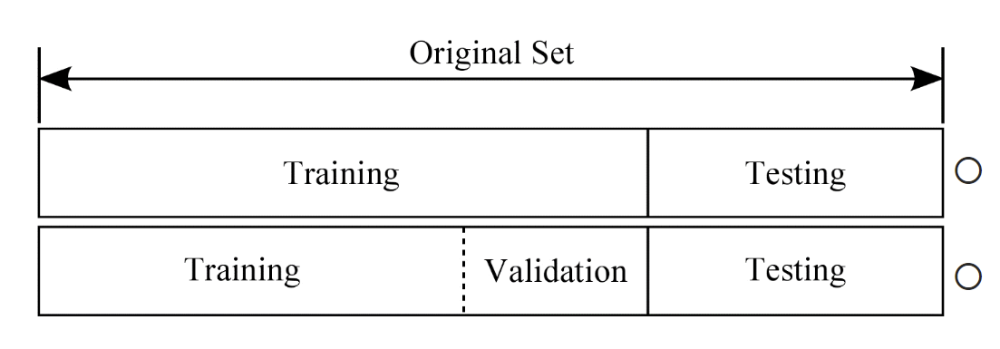

## 数据采集

常用数据预处理

1. 缺失值处理
2. 去除噪声
3. 删除离群点
4. 数据标准化

### 缺失值处理

多数算法无法处理有缺失数据，需要填补数据

> 如果某样本缺失较多数据，或某数据缺失较多样本，可以直接删除该样本或该数据

### 去除噪声

噪声是观测值和真实值之间的随机误差

### 删除离群点

离群点，指**奇异值**，指的是与绝对大多数数据差别极大的少量数据

> 在最近邻方法中奇异值会极大影响结果正确性

常用检测方法：$3\sigma$法

离群点未必要删除，可以对数据做变换（如对数变换），可能消除离群点且不损失信息

## 数据标准化

同[距离分类器-缩放方式](https://DinorexTimes.github.io/课程笔记/大三上/模式识别/距离分类器/#_9)

## 特征工程

- 适用于数据量少但有较多先验知识和领域知识的应用，模型可解释性和可调节性好

## 样本集的划分

- 训练集：训练模型的参数
- 验证集：检验模型在新数据上的表现，调整选择模型的超参数
- 测试集：最终评估模型的性能

> 必须要保证验证、测试集与实际应用的一致性

## 分类器性能评价

- 评价指标
    - 准确率（accuracy）：分类正确的样本数占总样本数的比例
    - 精确率（precision）：分类为正的样本中，真正的正样本数占所有正样本数的比例
    - 召回率（recall）：分类为正的样本中，真正的正样本数占所有正样本数的比例
    - F1-score：精确率和召回率的调和平均值
    - AUC-ROC：ROC曲线下的面积，越大越好

- 评价方法
    - 交叉验证
    - 两分法：将数据集分为正负两类，分别训练模型，在测试集上评估模型性能，选择最优模型
    - Bootstrap法

评价指标：

- 拒识：只对有把握的样本分分类