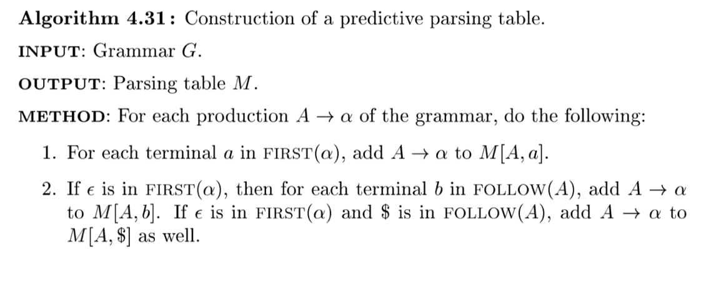

## FIRST集的计算

如果 $X \Rightarrow^* ε，那么 \epsilon\in FIRST(X)$

对串$X_1X_2\dots X_n$的FIRST集合

1. 向FIRST($X_1X_2\dots X_n$)加入FIRST(X1)中所有的非ε符号
2. 如果ε在FIRST($X_1$)中，再加入FIRST($X_2$)中的所有非ε符号；如果ε在FIRST($X_1$)和FIRST($X_2$)中，再加入FIRST($X_3$)中的所有非ε符号，以此类推
3. 最后，如果对所有的i，ε都在FIRST($X_i$)中，那么将ε加入到FIRST($X_1X_2\dots X_n$) 中

## FOLLOW集的计算

将$放入FOLLOW(S)中，其中S是开始符号，$是输入右端的结束标记

如果存在一个产生式$A→αBβ$，那么$FIRST ( β )$中除$ε$之外的所有符号都在$FOLLOW( B )$中

如果存在一个产生式$A→αB$，或存在产生式$A→αBβ$且$FIRST ( β )$包含ε，那么$FOLLOW( A )$中的所有符号都在$FOLLOW( B )$中

## 预测分析表的构造

- 构造预测分析表$M$，其中$M[A,a]$表示当输入符号为$a$时，当前状态为$A$时，应该采取的动作
- 对文法的每一条产生式$A\to\alpha$
    - 对所有在$FIRST(\alpha)$中的终结符$a$，将产生式$A\to \alpha$加入$M[A,a]$
    - 若$\epsilon\in FIRST(\alpha)$，对所有在$FOLLOW(A)$中的终结符$b$，将产生式$A\to \alpha$加入$M[A,b]$
    - 若结束符在$FOLLOW(A)$中，将产生式$A\to \alpha$加入$M[A,\$]$中