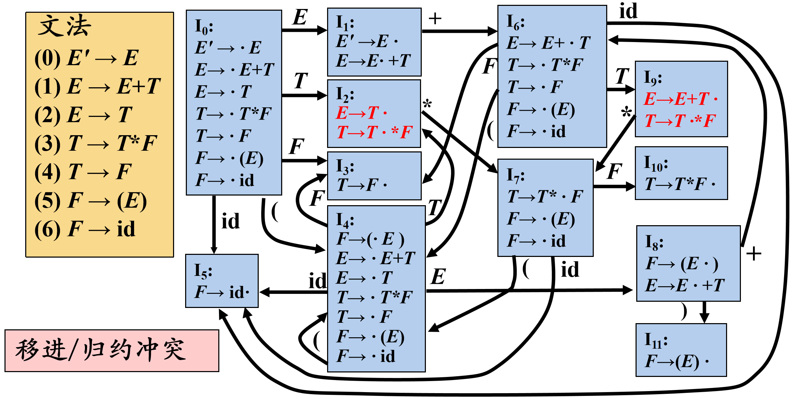

## LR(0)项目

右部某位置标有圆点的产生式称为相应文法的一个**LR(0)项目**

$$A\to \alpha_1\cdot\alpha_2$$

例：对产生式$S\to bBB$

$$\begin{cases}
    S\to \cdot bBB (移进项目)\\
    S\to b\cdot BB (待约项目)\\
    S\to bB\cdot B (待约项目)\\
    S\to bBB\cdot  (归约项目)\\
\end{cases}$$

> 项目描述了**句柄识别的状态** 
> 对于产生式$A→ε$，只会生成一个项目$A→ ·$ 

### 增广文法

如果$G$是一个以$S$为开始符号的文法，则$G$的增广文法$G'$就是在$G$中加上新开始符号$S'$和产生式$S'→S$而得到的文法

原因：引入这个新的开始产生式的目的是**使得文法开始符号仅出现在一个产生式的左边**，从而使得分析器只有一个接受状态

### 后继项目

**同属于一个产生式**的项目，但圆点的位置只**相差一个符号**，则称后者是前者的**后继项目**

比如：$A\to\alpha\cdot X\beta$的后继项目是$A\to \alpha X\cdot \beta$

### 等价项目

一个比较浅显易懂的解释：

例：上图中(3)号项目$S\to v\cdot I:T$，点的下一个字符为非终结符I，所以为了实现归约，我们“期待”某些产生式可以归约为非终结符$I$，而这些产生式(项目)就是所谓的**等价项目**

首先寻找左部为I的项目，注意到(7)(8)(9)(10)项目均符合，遍历(7)(8)(9)(10)项目，发现点的下一个字符分别为I、“,”、“i”，则结束搜索

> 可以把所有等价的项目组成一个项目集$I$ ，称为**项目集闭包**(Closure of Item Sets)，**每个项目集闭包对应着自动机的一个状态**

### CLOSURE函数

`CLOSURE(x)`，返回某一项目x的项目集闭包

### GOTO函数

`GOTO(I, x)`，输入当前状态I与符号x，返回下一个状态的项目集闭包

### 状态集构建

### LR(0)分析过程中的冲突

- **归约/移进冲突**

对$I_2$状态，若读取到*符号，既可以移进到$I_7$状态，也可以将$T$归约为$E$，存在冲突

需要额外添加约束来规避冲突，比如**SLR**便可以避免**归约/移进冲突**，另外还可以规避**归约/归约冲突**