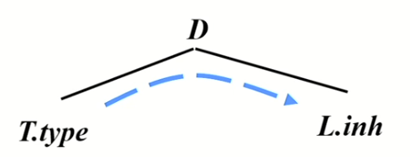

### 综合属性

### 继承属性

在分析树结点N上的非终结符A的继承属性只能通过**N的父节点**、**N的兄弟节点**、**N本身的属性值**来定义

例：

|产生式|语义规则|
|----|----|
|D→TL|L.inh = T.type|

> 规定终结符没有继承属性，终结符从词法分析器获得的属性值被归为**综合属性值**

## SDD的求值顺序

### 属性值的求值顺序

可行的求值顺序是满足下列条件的$N_1,N_2,...,N_k$：若依赖图中有一条从$N_i$到$N_j$的边，那么$i<j$

## 句法制导翻译方案SDT

### SDD转换为SDT

- S-SDD
    - 将每个语义动作都放在产生式之后

- L-SDD
    - 对于综合属性，将其放在产生式最后
    - 对于某个非终结符A的继承属性的动作插入到产生式右部中紧靠在A的本次出现之前的位置上

## 在非递归的预测分析过程中进行翻译

### 扩展句法分析栈

> A的**继承属性**放在A本身的记录当中；由于A的**综合属性**产生的时间不同，所以放在Asyn中；此外还有记录**语义动作代码**的指针