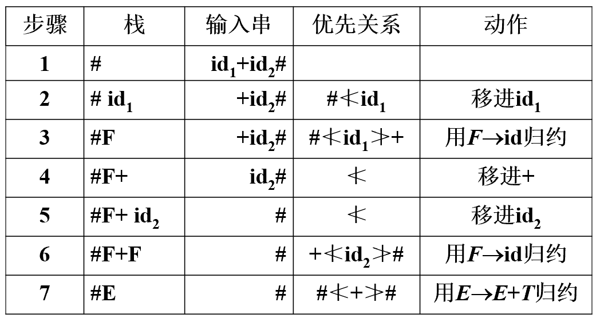

## 算符文法

如果文法G中不存在形如

$$A\to \alpha BC \beta$$

的产生式，则称之为算符文法（OG，operator grammar）

> 换句话说，就是文法G中不存在**具有相邻非终结符**的产生式

## 算法优先文法

设G为OG，如果$\forall a,b \in T, a \equiv b, a≮b, a≯b$至多有一个成立，则称为算符优先文法（

> $A ≮B$：A优先级低于B，$A ≯B$：A优先级高于B，$A\equiv B$优先级相同

在没有$\epsilon$的算符文法G中，如果任意两个终结符之间之多有一种优先关系，则称为**算符优先文法**

### 优先关系定义

假设G是一个不含ε-产生式的文法，A、B和C均是G的语法变量，G的任何一对终结符a和b之间的优先关系定义为：

- 如果$a\equiv b$，当且仅当文法G中含有$A\to \dots ab\dots$或A\to \dots aBb \dots$的产生式
- 如果$a≮b$，当且仅当文法G中含有$A\to \dots aB\dots$的产生式，而且$B\Rightarrow^+ b\dots$或$B\Rightarrow^+ Cb\dots$
- 如果$a≯b$，当且仅当文法G中含有$A\to \dots Bb \dots$的产生式，而且$B\Rightarrow^+ \dots a$或$B\Rightarrow^+ \dots aC$
- a与b无关系，当且仅当a与b在G的任何句型中都不相邻

### 优先关系求解

- 如果$a≮b$，$A\to \dots aB\dots$的产生式
    - 需要求出非终结符B派生出的**第一个终结符集**
- 如果$a≯b$，有$A\to \dots Bb \dots$的产生式
    - 需要求出非终结符B派生出的**最后一个终结符集**

设G为OG，定义：

- $\text{FIRSTOP}(A)=\{b|A\Rightarrow^+ b\dots 或者 A\Rightarrow^+ Bb\dots, b\in T,B \in V\}$
- $\text{LASTOP}(A)=\{b|A\Rightarrow^+ \dots b 或者 A\Rightarrow^+ \dots bB, b\in T,B \in V\}$

### 定理

对$A\to B\dots \in P$，有$\text{FIRSTOP}(B)\subseteq \text{FIRSTOP}(A)$

对$A\to \dots B\in P$，有$\text{LASTOP}(B)\subseteq \text{LASTOP}(A)$

$A\to \dots aB\dots$，有$\forall b\in \text{FIRSTOP}(B), a \nless b$

$A\to \dots Bb\dots$，有$\forall a\in \text{LASTOP}(B), a\ngtr b$

## 算符优先分析算法

原理：

1. 识别句柄并归约
2. 各种优先关系存放在算符优先分析表中
3. 利用$\ngtr$识别句柄尾，利用$\nless$识别句柄头，分析栈存放已识别部分，**比较栈顶和下一项输入符号的关系**，如果是句柄尾，则沿着栈顶向下寻找句柄头，找到后弹出句柄，归约为非终结符

### 算法应用举例

$E→E+T|E-T|T \quad T→T*F|T/F|F \quad F→(E)|id$利用算符优先分析法对id+id进行分析

### 存在的问题

- 有时并没有归约真正的句柄(F)
- 不是严格的最左归约
- 归约的符号串有时与产生式右部不同

仍能正确识别句子的原因

- ==定义算符优先分析过程识别的“句柄”为**最左素短语**LPP==

## 素短语与最左素短语

$S\Rightarrow^* \alpha A \beta \text{and} A\Rightarrow^+ \gamma$，$\gamma$**至少含有一个终结符**，并且不含更小的含终结符的短语，那么称$\gamma$是句型$\alpha \gamma \beta$的相对于变量A的**素短语**