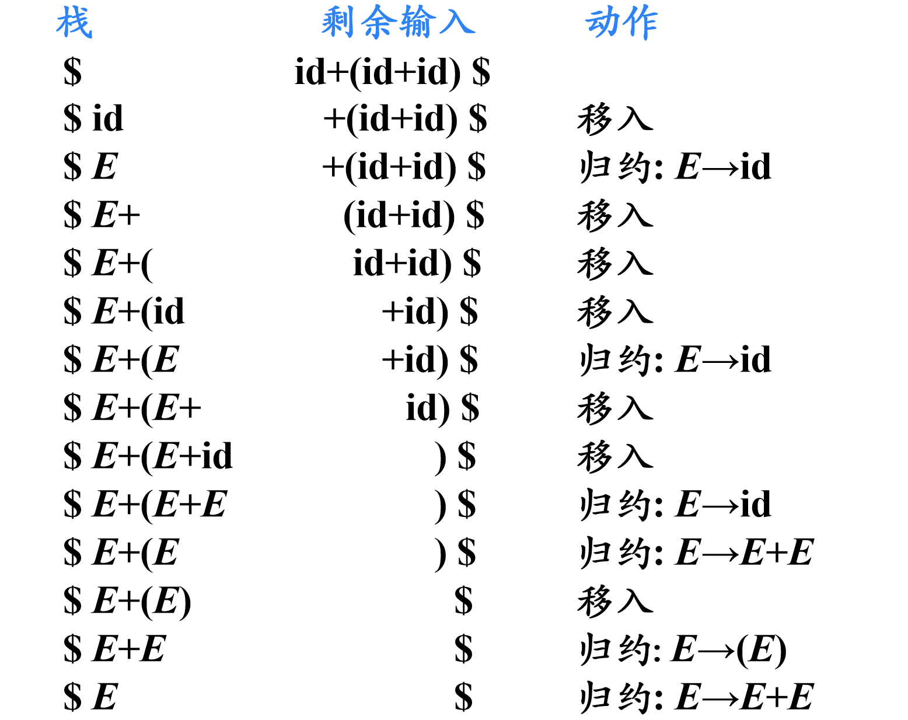
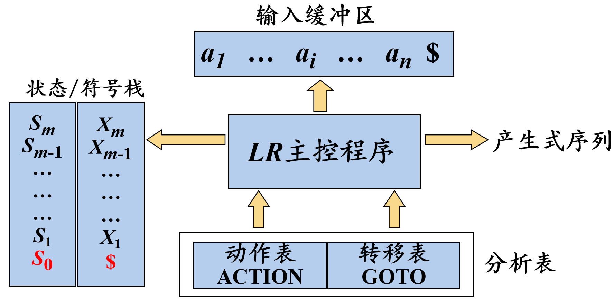
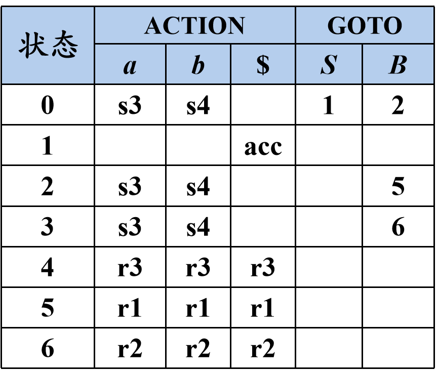

## 自底向上的语法分析

- 从分析树的**底部**(叶节点)向**顶部**(根节点)方向构造分析树
- 可以看成是**将输入串w归约为文法开始符号S**的过程
- **自顶向下**的语法分析采用**最左推导**方式
- **自底向上**的语法分析采用**最左归约**方式（反向构造最右推导）

自底向上语法分析的通用框架

- **移入-归约分析**(Shift-Reduce Parsing)

## 移入-归约分析工作流程

1. 在对输入串的一次从左到右扫描过程中，语法分析器将零个或多个输入符号**移入**到**栈的顶端**，直到它可以对栈顶的一个文法符号串β进行**归约**为止
2. 然后，它将β**归约**为某个产生式的左部
3. 语法分析器不断地重复这个循环，直到它检测到一个语法错误，或者栈中包含了开始符号且输入缓冲区为空(当进入这样的格局时，语法分析器停止运行，并宣称成功完成了语法分析)为止

例：有如下产生式

```
E -> E + E
E -> E * E
E -> (E)
E -> id
```

{width=400}

移入-归约分析器可采取的4种动作

1. **移入**：将下一个输入符号移到栈的顶端
2. **归约**：被归约的符号串的右端必然处于栈顶。语法分析器在栈中确定这个串的左端，并决定用哪个非终结符来替换这个串
3. **接收**：宣布语法分析过程成功完成
4. **报错**：发现一个语法错误，并调用错误恢复子例程

## 移入-归约分析的问题

例：有产生式

```
<S> -> var<IDS>:<T>
<IDS> -> i
<IDS> -> <IDS>, i
<T> -> real|int
```

{width=500}

> 在上述分析过程中，红线处存在歧义，即$i_B$既可以单独归约为`<IDS>`，也可以与栈中的`<IDS>, `一同归约为`<IDS>`，这样便会错误地识别句柄

## LR分析法概述

LR文法(Knuth, 1963) 是最大的、可以构造出相应移入-归约句法分析器的文法类

> L指的是对输入从左到右进行扫描<br>
> R指的是反向构造出一个最右推导序列

LR(k)分析

需要向前查看k个输入符号的LR分析

> k=0和k=1这两种情况具有实践意义,当省略(k)时，表示k=1 

### LR分析表结构



LR分析器核心结构为**LR分析表**，其包含两个部分：

1. `ACTION[s, a]`**动作表**，规定当状态s面临输入符号a时，应采取什么动作（移进、归约、接受、 报错）
2. `GOTO[s, X]`**状态转换表**，规定了状态s面对文法符号X时，下一状态是什么。

例：有如下文法

```
S->BB
B->aB
B->b
```

{width=400}

> sn:将符号a、状态n压入栈中<br>
> rn:用第n个产生式进行归约

### LR分析器工作过程

对输入字符串$a_1a_2a_3\dots a_n\$$

1. 若ACTION [sm, ai]= sx，那么格局变为

```
s0s1 … sm x 
$ X1 … Xm ai 
```

2. 如果$ACTION[s_m, a_i]= rx$表示用第x个产生式$A\to X_{m-(k-1)}\dots X_m$进行归约，那么格局变为

```
s0s1 … sm-k
$ X1 … Xm-k A 
```

如果$GOTO[s_{m-k}, A]=y$，那么格局变为

```
s0s1 … sm-k y  
$ X1 … Xm-k A
```

3. 如果$ACTION[s_m, a_i]= acc$，那么分析成功
4. 如果$ACTION[s_m, a_i]= err$，那么出现句法错误

那么如何构造LR分析表？

1. LR(0)分析
2. SLR分析
3. LR(1)分析
4. LALR分析