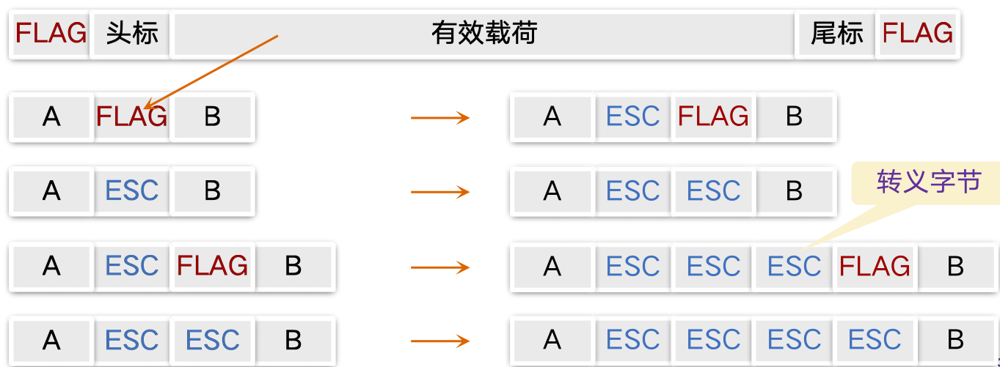
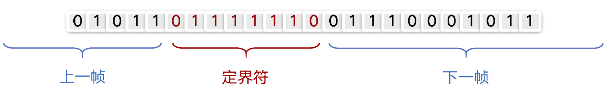
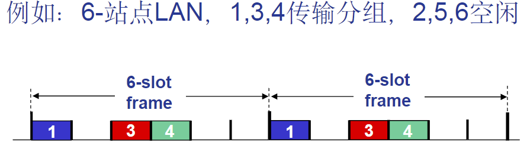
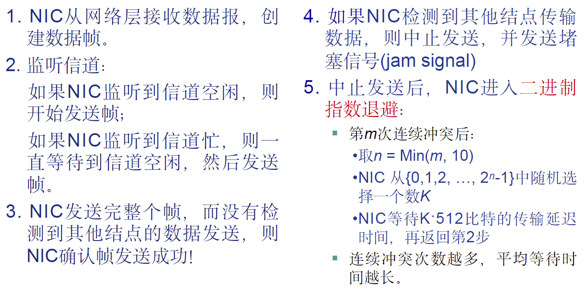
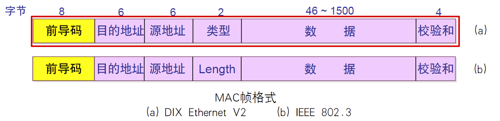

## 数据链路层服务

向下：利用物理层提供的位流服务

向上：向网络层提供**明确的服务接口**

### 关键词

结点：主机、路由器、交换机

链路：链接相邻节点的通信信道

帧：链路层数据分组，封装网络层的数据报

> 数据链路层负责通过一条链路从一个节点向另外一个**物理链路**直接相连的相邻节点传送数据包

## 组帧（framing）

1. 封装网络层数据报构成数据帧
2. 帧同步：从物理层接收的比特流中准确区分出一帧的开始与结束

> 一般通过字节计数法、带字节填充的定界符法

所谓定界符法，就是使用一个特殊的字节（比如0x7E）来区分前后两个不同的帧

如果有效载荷部分出现了与“定界符”相同的字节怎么办？

带比特填充的定界符法：比如在两个0比特之间，连续6个1比特

如果有效载荷部分包含与定界符相同的位组合怎么办？

## 差错检测与差错控制

### 差错检测：差错编码

基本原理：$D\to DR$，其中R为差错检测与纠正比特（也称为冗余比特）

但是差错编码不能保证100%可靠！

### 差错编码的纠错能力

差错编码可分为**检错码**和**纠错码**

汉明距离：等长的两个码字之间对应位不相同的数目

对于检错码：如果汉明距离$d_s=r+1$，那么该差错编码可以检测r位差错

> 例如，编码集 {0000,0101,1010,1111} 的汉明距离ds=2，可以100%检测1比特差错

对于纠错码：如果汉明距离$d_s=2r+1$，那么该差错编码可以纠正r位差错

> 例如，编码集 {000000,010101,101010,111111} 的汉明距离ds=3，可以纠正1比特差错，如100010纠正为101010

### 奇偶校验码

### 循环冗余校验码(CRC)

## 可靠数据传输

## 多路访问控制(MAC)协议

两类链路：

- 点对点链路
- 广播链路
    - 共享介质
    - 早期的总线以太网
    - 802.11无线局域网

### 理想的MAC协议

给定：速率为R bps的广播信道

期望：

- 当只有一个节点希望传输数据时，可以以速率R发送
- 当有M个结点期望发送数据时，每个节点平均发送数据的平均速率是R/M
- 完全分散，无需时钟、时隙同步

### 信道划分MAC协议

#### TDMA

“周期性”接入信道，每个站点在每个周期占用固定长度的时隙，未用时**空闲**

#### FDMA

将信道频谱划分为若干个频带

每个站点分配一个固定的频带，没有传输时**频带空闲**

### 随机访问MAC协议

- 利用信道全部数据速率R发送分组
- 没有事先的结点间协调

当有两个或以上的结点同时传输就会导致冲突

所有的随机访问MAC协议都需要定义

- 如何检测冲突
- 如何从冲突中恢复

#### 时隙ALOHA

所有的帧大小相同，时间被划分为等长的时隙，每个结点只能在时隙开始时刻发送帧，结点间时钟同步，如果2个或2个以上结点在同一个时隙发送帧，结点即检测到冲突

当结点有新的帧时，在下一个时隙(slot)发送

- 如果无冲突：该结点可以在下一个时隙继续发送新的帧
- 如果冲突：该结点在下一个时隙以概率p重传该帧，直至成功

对于一个给定的结点，在一个时隙将帧成功发送的概率=$p(1-p)^{N-1}$

最大效率：使得$Np(1-p)^{N-1}$最大的p*，当N趋于无穷时，有$p*=\frac{1}{e}\approx 0.37$

#### ALOHA

与时隙ALOHA类似，但不要求所有结点在同一时隙发送帧，而是随机选择一个结点在时隙开始时刻发送帧（无需同步）

当有新的帧生成，立即发送

缺点：冲突可能性增大，$p* = \frac{1}{2e} \approx 0.18$

> 比时隙ALOHA协议更差！

#### CSMA、CSMA/CD、CSMA/CA

CSMA全称：载波监听多路访问协议

### 轮转MAC协议

## 局域网技术

### 链路层寻址：MAC地址

- MAC地址（又称为LAN地址、物理地址、以太网地址）
    - 局域网中的每一块网卡都有唯一的MAC地址
    - 作用：用于标识局域网内标识一个帧从哪个接口发出，达到哪个物理相连的其它接口
    MAC地址48位
    - 一般固化在网卡的ROM中，有时也可以用软件设置
- IP地址
    - IPV4地址32位
    - 接口的网络层地址
    - 用于标识网络层分组，支持分组转发

### 以太网

提供不可靠、无连接服务

- 不可靠：接收网卡不向发送网卡进行确认，差错帧直接丢弃
- 无连接：发送帧的网卡与接收帧的网卡之间没有**握手过程**

物理拓扑：

- 总线：上世纪90年代中期前流行
    - 所有结点在同一个冲突域
- 星型拓扑：目前主流网络拓扑
    - 包含中心交换机
    - 每个结点都是一个单独冲突域

以太网的MAC协议：**二进制指数退避算法的CSMA/CD**

#### 以太网的二进制指数退避算法

#### 以太网帧结构

发送端网卡将IP数据报封装到以太网帧中

> 前导码(Preamble)(8B): 7个字节的10101010，第8字节为10101011；用于发送端与接收端的时钟同步，通常不计入帧长

### 以太网交换机(switch)

属于链路层设备

- 存储-转发以太网帧
- 检验到达帧的目的MAC地址，选择性(selectively) 向一个或多个输出链路转发帧
- 利用CSMA/CD访问链路，发送帧

## PPP协议

## 链路虚拟化