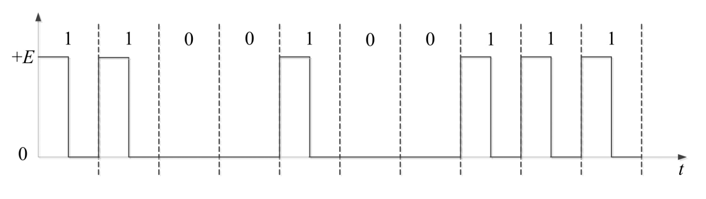

## 物理层基本功能

在连接结点得物理介质上实现比特流的传输

### 异步通信

## 物理介质

### 导引型传输介质

- 架空明线
- 双绞线
    - 主要用于基带传输
    - 分为屏蔽双绞线和非屏蔽双绞线

- 同轴电缆
    - 主要用于频带传输
- 光纤
    - 基本原理：全反射
    - 分为多模光纤和单模光纤

### 非导引型传输介质

- 地波传播
- 天波传播
- 视线传播

## 信道与信道容量

### 信道分类

- 狭义信道
    - 信号传输介质
- 广义信道
    - 包含信号传输介质和通信系统的一些变换装置（发送设备、接受设备、调制器等）

- 恒参信道
    - 理想的恒参信道是一个理想的无失真传输信道
    - 对信号幅值产生固定的衰减
    - 对信号输出产生固定的时延
- 随参信道
    - 信号的传输衰减/时延随时间随机变化
    - 存在**多径传播现象**

### 信道容量

信道容量是指信道无差错传输信息的**最大平均信息速率**

- Nyquist信道容量公式（理想信道的极限容量）

$$C=2B\log_2M$$

> C：信道容量，单位为比特/秒(bps) 
> B：信道带宽，单位为赫兹(Hz) 
> M：进制数，即信号状态数 

- Shannon信道容量公式（实际信道的理论容量）

$$C=B\log_2(1+S/N)$$

> S/N：信噪比，即信道上信号与噪声的能量之比 
> S/N通常以分贝为单位进行描述，即$(S/N)_{db}=10\log_{10}(Signal Power/Noise Power)$

## 信道共享-多路复用

- 将链路/网络资源划分为资源片，将资源片分配给各路呼叫，
- 每路呼叫独占分配到的资源片进行通信
- 资源片可能闲置

### 频分多路复用（FDM）

{width=70%}

各用户占用不同的带宽资源，用户分配到一定频带后，会在通信过程中一直占用这个频带

### 时分多路复用（TDM）

TDM将时间划分为一段段等长的**时分复用帧**（TDM帧），每个用户占用固定数量的**时隙**，每个时隙只传输一路数据，用户轮流占用时隙，互不干扰

> 类似OS的时间片轮询方式，每个process轮流占用CPU的时间片，互不干扰

时分复用的所有用户在不同的时间占用相同的频带

### 波分多路复用（WDM）

波分多路复用（WDM）是指利用光的频谱特性，将光的频谱划分为若干波段，每个用户占用一部分波段，互不干扰，实现多用户同时通信。

> 波分复用就是光的“频分复用”

### 码分多路复用（CDM）

广泛应用于无线链路共享 (如蜂窝网,卫星通信等)

每个用户分配一个唯一的m bit**码片序列**(chipping sequence)，其中
“0”用“-1”表示、“1”用“+1”表示

各用户使用相同频率载波，利用各自码片序列编码数据

编码信号 = (原始数据) × (码片序列)

要求：各用户码片序列**相互正交**

$$\frac{1}{m}S_i\cdot S_j=\begin{cases}
    1,&i=j\\0,&i\neq j
\end{cases}$$

$$\frac{1}{m}S_i\cdot \bar{S_j}=\begin{cases}
    0,&i\neq j\\-1,&i=j
\end{cases}$$

解码：码片序列与编码信号的内积

$$d_i=\frac{1}{m}S_i\cdot P=\begin{cases}
    1&S_i\in P\\-1&\bar{S_i} \in P\\0&S_i,\bar{S_i}\notin P
\end{cases}$$

## 基带传输

- 信源发出的原始电信号称为“基带信号”
    - 模拟信源>模拟基带信号
    - 数字信源>数字基带信号

**直接在信道中传送基带信号**称**为基带传输**

基带信号往往包含有较多的**低频成分**，甚至有**直流成分**
实现基带传输的系统称为基带传输系统

在信道中直接传输数字基带信号，称为数字基带传输，相应的系统称为数字基带传输系统

### 典型数字基带信号码型

- 单极不归零码（NRZ）
    - 易于产生，但不适合长距离传输

- 双极不归零码（DNRZ）
- 单极归零码（RZ）
    - 码元不为零的时间占一个码元周期的百分比称为“**占空比**”
    - 若码元不为零的时间为Tb/2，码元周期为Tb，则占空比为50%

- 双极归零码（DRZ）
- 差分码
    - 差分码又称为相对码
    - 如：相邻脉冲有电平跳变表示为1，无跳变表示0

- AMI码
    - 全称为**信号交替反转码**
    - 编码规则：
        - 信息码中的0编码为AMI传输码中的0
        - 信息码中的1编码为AMI传输码中的1（正脉冲）和-1（负脉冲）

## 频带传输

基信号具有低通特性，而许多的带通信道不具有低通特性，只能利用基带信号去调制与对应信道传输特性相匹配的载波信号

通过在信道中传送经过调制的载波信号实现将基带信号所携带信息传送出去

> 利用模拟基带信号调制载波，称为模拟调制，利用数字基带信号调制载波，称为数字调制

### 数字调制系统

频带传输系统通常使用正弦波作为载波

$$y(t)=a\cos(2\pi ft+\phi)$$

### 二进制幅移键控（2ASK）

### 二进制频移键控（2FSK）

选择两个不同频率的载波$f_1$和$f_2$，二进制基带信号编码的信息序列为$\{b_n\}$

$$y'(t)=\begin{cases}
    \cos(2\pi f_1 t),&b_n=0\\
    \cos(2\pi f_2 t),&b_n=1
\end{cases}\quad 0<t<T_b$$

### 二进制相移键控（2PSK）

$$y'(t)=\cos(2\pi ft+\phi(b_n))$$

$$\phi=\begin{cases}
    \phi_0,&b_n=0\\
    \phi_0+\pi,&b_n=1
\end{cases}$$

### 二进制差分相移键控

利用相邻两个码元载波间的相对相位变化表示数字基带信号的数字信息

$$y'(t)=\cos(2\pi ft+\phi_{n-1}+\delta \phi(b_n))$$

其中$\delta(\phi_{n})=\begin{cases}
    0,&b_n=0\\
    \pi,&b_n=1
\end{cases}$

## 二进制数字调制性能

- 频带利用率
    - 2ASK、2PSK、2DPSK频带利用率相同
    - 2FSK频带利用率最低
- 误码率
    - 相同信噪比下，2PSK的误码率最低，2ASK误码率最高
- 对信道特性敏感性
    - 2ASK较为敏感，性能最差
    - 2PSK、2FSK对信道特性不敏感

## 多进制数字调制

确定贷款与频带利用率时，可以通过**提高每个码元的传输信息量，每个码元调制多个比特信息**来提高数据传输速率

数据传输速率$R_b$与码元传输速率$R_B$以及进制数$M$的关系为

$$R_b=R_B\log_2 M$$

### 正交幅值调制（QAM）

也称为幅值相位联合键控(APK)

QAM的调制信号幅值和相位均受基带信号调制，可表示为

$$y'(t)=A_n\cos(2\pi ft)+B_n\sin(2\pi ft)$$

$$\begin{cases}
    A_n=s_n\cos(\phi_n)\\
    B_n=-s_n\sin(\phi_n)
\end{cases}$$

QAM信号是由两路相互正交载波经调制后叠加而成：

两路载波信号的幅值分别被离散幅值序列{An}和{Bn}所调制，分别称为同相信号（I信号）和正交信号（Q信号）