## 网络层服务

从发送主机向接收主机发送数据段

路由器检验所有穿越它的IP数据报的**头部域**

网络层核心功能：**转发与路由**

### 网络层拥塞控制策略

例：ATM ABR控制拥塞

ABR：如果发送方路径拥塞，将发送速率降低到最低保障速率

RM：由发送方发送，交换机设置RM cell位，NI bit表示速率不许增长，CI bit表示拥塞指示

## 虚电路网络与数据报网络

数据报网络提供**网络层无连接服务**，虚电路网络提供**网络层连接服务**

> 类似于传输层的无连接服务UDP和面向连接服务TCP，不同之处在于：是主机到主机服务，同时也是网络核心的实现

### 虚电路

从一个源主机到目的主机，类似于电路的路径（是逻辑连接）

- **分组交换**
- 每个分组的传输利用链路的全部带宽
- 源到目的路径经过的网络层设备共同完成虚电路功能

每个分组携带**虚电路标识**（VC ID），而**不是目的主机地址**

虚电路经过每个网络设备，维护每条经过它的虚电路连接状态

链路、网络设备资源，可以面向VC进行**预分配**

### VC的具体实现

每条虚电路包括：

1. 从源主机到目的主机的一条路径
2. 虚电路标识（VC ID），沿路每段链路一个编号
3. 沿路每个网络层设备都利用转发表记录经过的每一条虚电路

> 沿某条虚电路传输的分组，携带对应虚电路的VCID，而不是目的地址
>
> 同一条VC，在每一段链路上的VCID通常不同

### VC转发表

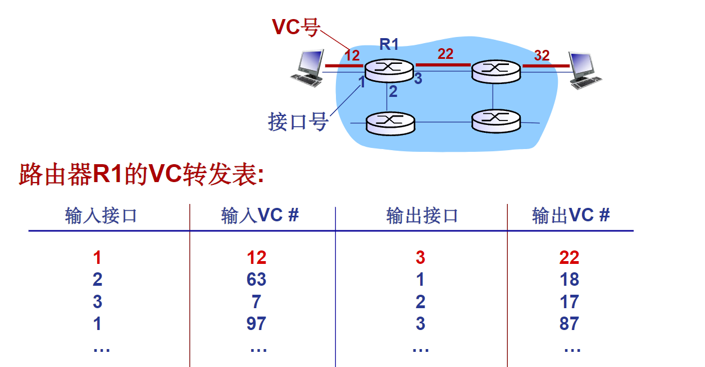

> VC路径上的**每个路由器**都需要维护VC连接的状态信息

### 虚电路信令协议

- 主要用于VC的建立维护与拆除
- 应用于虚电路网络
- 目前Internet不采用

### 数据报转发表

由路由算法确定通过网络的端到端路径，转发表确定在本路由器如何转发分组

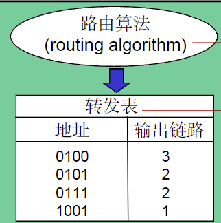

> 存在40多亿个IP地址，为了减少路由表大小，将IP地址分组，当IP地址属于某个范围，则使用相对应的链路接口转发

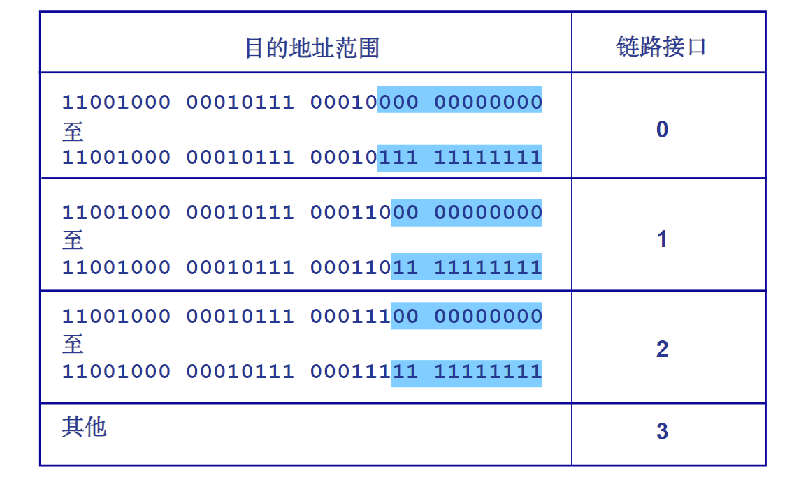

### 最长前缀匹配优先

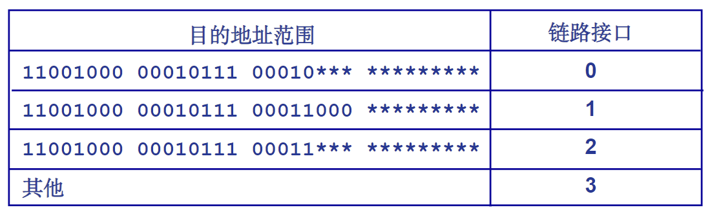

在检索转发表时，优先选择与分组目的地址**匹配前缀最长**的入口

## 路由器体系结构

## IP协议

### IP数据报分组格式

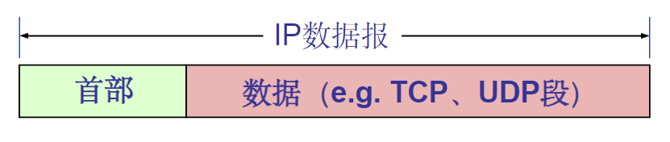

## IP相关协议

### ICMP协议

全称为**互联网报文控制协议**

ICMP协议是IP协议的一部分，用于报告网络层事件和错误

ICMP报文分为两类：

- 差错报告报文
    - 目的不可达
    - 源抑制
    - 超时/超期
    - 参数问题
    - 重定向
- 网络探寻报文
    - 回声请求与应答报文
    - 时间戳请求与应答报文

> 几种**不**发送ICMP差错报告报文的特殊情况：
>
> 1. 对ICMP差错报告报文的响应，不发送ICMP差错报告报文
> 2. 除了第1个IP数据报分片外，对后续所有分片都不发送
> 3. 对所有多播IP数据报，不发送ICMP差错报告报文
> 4. 对具有特殊地址的IP数据报不发送ICMP差错报告报文

ICMP报文封装到IP数据报中传输

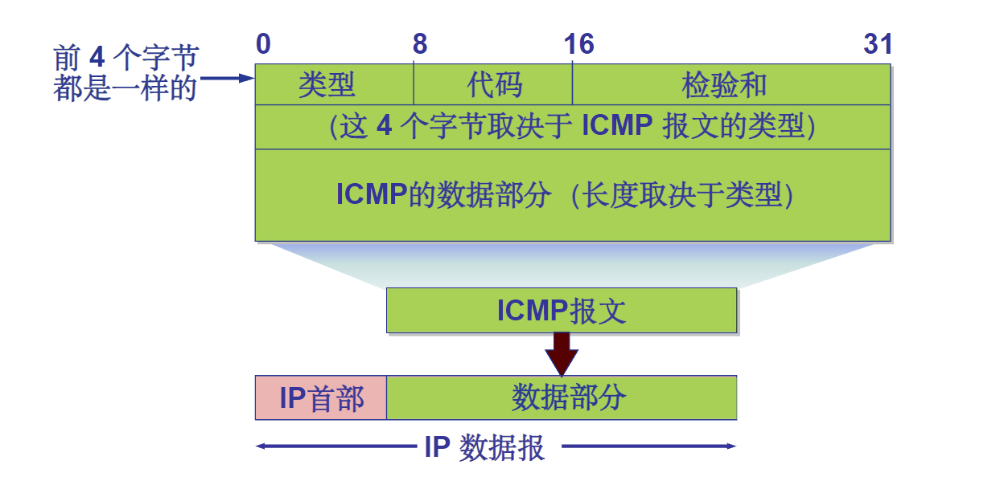

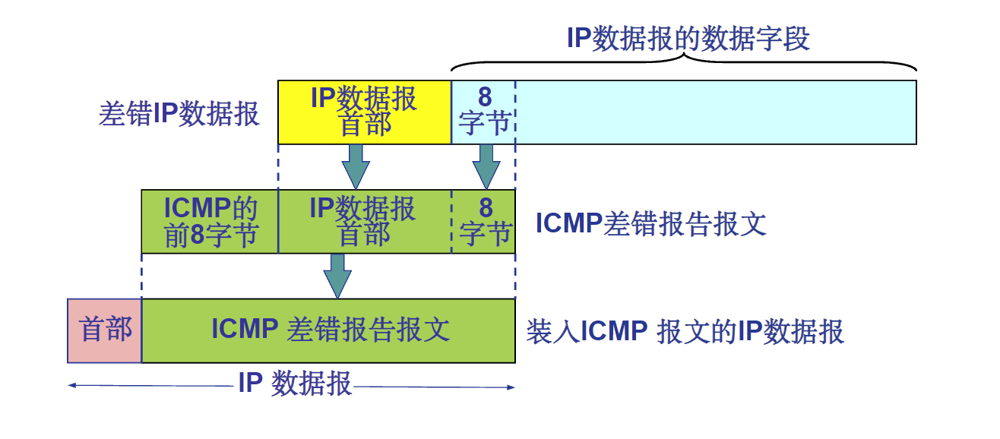

### 如何获得IP地址？

硬编码：静态配置

#### 动态主机配置协议DHCP

- 从服务器动态获取
    - IP地址
    - 子网掩码
    - 默认网关地址
    - DNS服务器名称与IP地址

由客户端（DHCP Client）向服务器（DHCP Server）提出配置申请，DHCP Server为网络上的每个设备动态分配IP地址、子网掩码、默认网关地址，域名服务器（DNS）地址和其他相关配置参数，以便可以与其他IP网络通信。

DHCP流程

1. 主机广播发送DHCP DISCOVER“发现报文”
2. DHCP服务器利用DHCP OFFER“提供报文”响应
3. 主机请求IP地址DHCP REQUEST“请求报文”
4. DHCP服务器为期分配IP地址 DHCP ACK“确认报文”

### 网络地址转换（NAT）

- 网络地址转换（NAT）是一种IP地址转换技术，它允许多个私有网络使用同一个公共IP地址。

优势：

- 本地网络设备IP地址变更，无须通知外界网络
- 变更ISP时，无需修改内部网络设备IP地址
- 内部网络设备对外界网络不可见，即不可直接寻址

所有离开本地网络去往Internet的数据报的源IP必须替换为相同的NAT地址；本地网络内部的通信的IP数据报的源与目的IP地址均在子网内

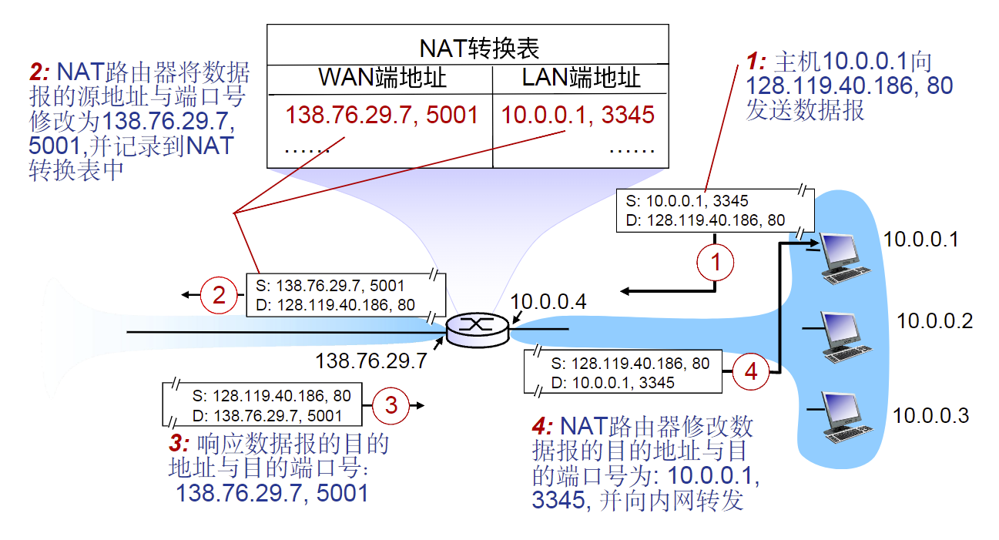

#### NAT穿透问题

- 客户期望连接内网地址为10.0.0.1的服务器，客户不能直接利用地址10.0.0.1直接访问
- 对外唯一可见NAT地址：138.76.29.7

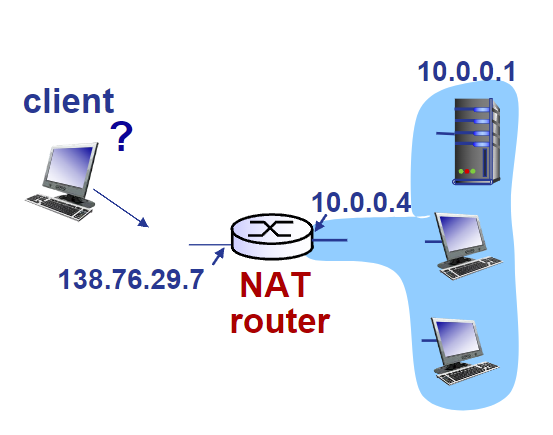

- 解决方法1：静态配置NAT，将特定端口的连接请求转发给服务器
- 解决方法2：利用UPnP互联网网关设备协议(IGD)自动配置
- 解决方法3：中继，NAT内部客户和中继服务器建立连接，外部客户也和中继服务器连接

### ARP协议

在同一个LAN内，如何在已知目的接口的IP地址的前提下确定其MAC地址？

LAN中每一个IP节点都维护了一个`<IP,MAC>`表，ARP协议主要是查询和更新这个表，表附带了TTL（Time-to-Live）字段，用来限制ARP表项的生存时间。

#### 同一局域网内

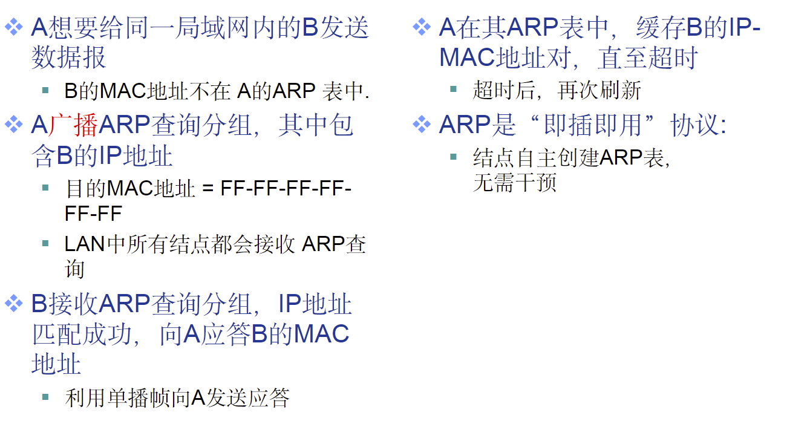

#### 从一个LAN路由至另一个LAN

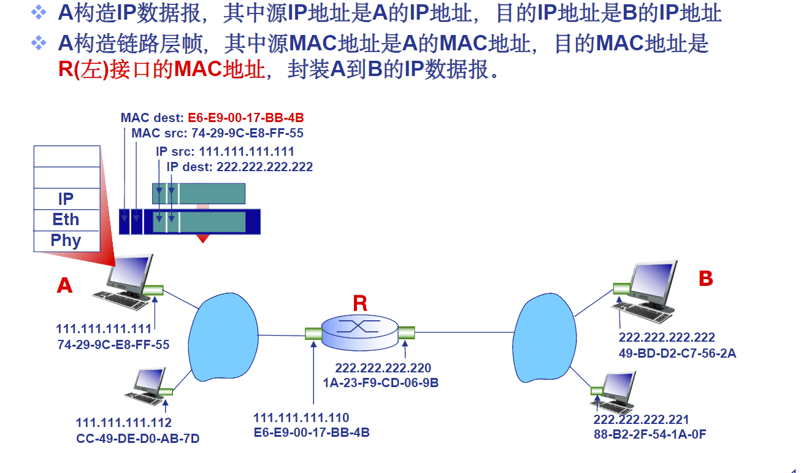

## 路由算法

### 路由与转发

路由算法确定去往目的网络的最佳路径；转发表确定在本路由器如何转发分组

### 网络抽象

可以将网络抽象为图

N表示路由器集合，E表示所有的链路集合

### Djikstra算法

所有节点掌握网络拓扑和链路费用，需要计算的是：计算一个点（源点）到所有其他点的最短路径，令：

- $c(x,y)$为结点x到结点y链路费用；如果x和y不直接相连，则$c(x,y)=\infty$
- $D(v)$为从源到目的地v的当前路径费用值
- $p(v)$为沿这从源到v的当前路径，v的**前序结点**
- $N'$为已经找到最小费用路径的结点结合

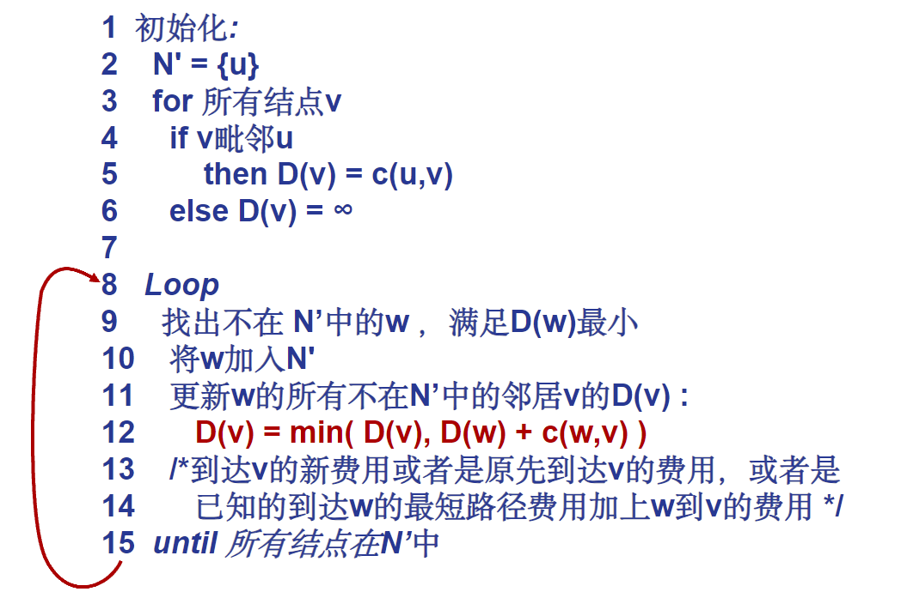

### 距离向量路由算法

#### Bellman-Ford算法

令$d_x(y)=从x到y的最短路径的费用$

更新逻辑为：$d_x(y)=\min_{v}\{c(x,y)+d_v(y)\}$

> 选择所有$len(x\to v)+len(v\to y)$中的最小值作为$d_x(y)$的候选值

路由器据此获得了最短路径的下一跳，该信息用于转发表中

#### DV算法

$D_x(y)$表示从结点x到结点y的最小费用估计，x需要维护的是距离向量(DV)，即

$$D_x=[D_x(y): y\in N]$$

结点x已知到达每个邻居的费用$c(x,v)$

结点x需要维护：

其所有邻居的距离向量$D_v=[D_v(y): y\in N]$

核心思想：

- 每个结点不定时地将自己的DV估计发送给邻居
- 当结点x接受到邻居的新的DV估计时，根据B-F更新其自身的距离向量估计

$$D_x{y}\leftarrow\min_v{c(x,v)+D_v(y)} for each node y\in N$$

#### DV的更新

对于每个结点x，都处在一个循环当中

- 等待：本地局部链路费用变化火或者收到了邻居的DV更新
- 重新计算：DV估计
- 如果DV中到达任意一个目的地的距离发生了改变，则需要**通告所有邻居**

## 层次路由

将任意规模大小的网络抽象为一个图计算过于理想化

1. 网络规模过大，路由表无法存储所有路由信息
2. 路由计算过程的信息交换量巨大，会淹没链路

聚合路由器为一个区域：自治系统（AS：Autonomous Systems）

同一个AS内部的路由器运行相同的路由协议

### 网关路由器

位于AS的边缘，通过链路链接其他AS的网关路由器

## 路由协议

Internet采用层次路由

AS内部路由协议也称为内部网络协议IGP

常见的IGP

- 路由信息协议：RIP
- 开放最短路径优先：OSPF
- 内部网关路由协议：IGRP

### RIP

距离向量路由算法

- 距离向量：跳步数，每条链路一个跳步
- 每隔30s，邻居之间交换一次DV，称为通告
- 每次通告：最多25个目的子网