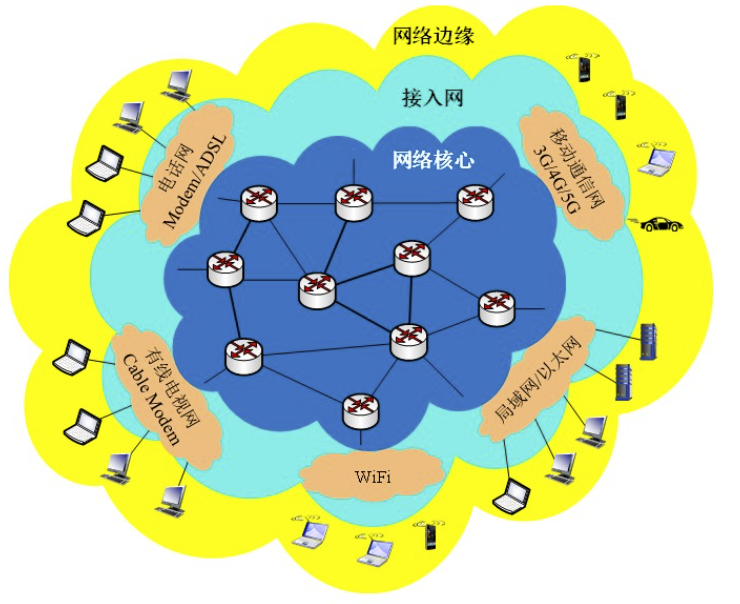
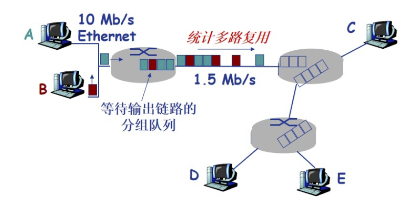
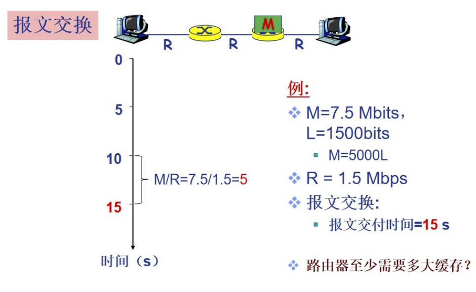
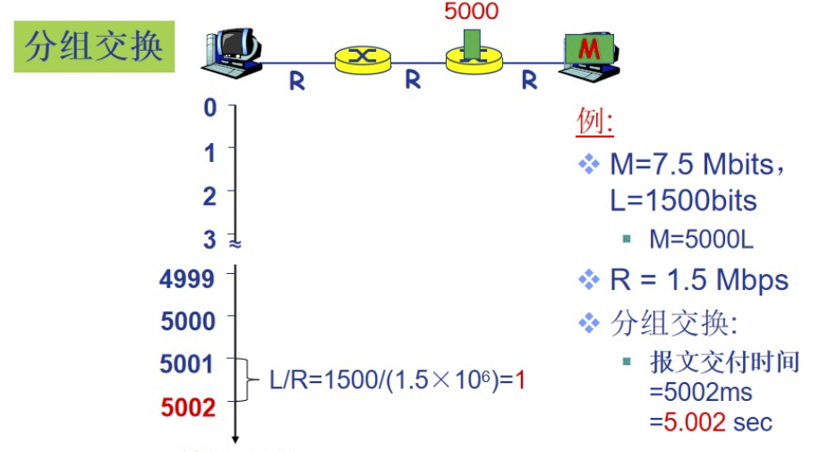

## 计算机网络基本概念

$$信源\to 发送设备\to 信道\to 接收设备\to 信宿$$

计算机网络就是一种**通信网络**

定义：计算机网络是**互连的，自洽的计算机集合**

- 自洽-无主从关系
- 互连-互联互通

如何互连主机？

- 通过交换网络互连主机
- 交换网络中包含大量的**交换节点**（交换机或者路由器）

什么是Internet？

- 全球最大的互联网络
    - ISP网络称之为网络之网络
- 是数以百万计的互连的计算设备集合
    - 主机=端系统
    - 运行各种网络应用
- 分组交换：转发分组（数据包）
    - 路由器
    - 交换机

为网络应用提供通信服务的基础设施

- Web
- 电子邮件
- 网络游戏
- 电子商务...

仅有硬件连接，Internet能否顺畅运行？能保证应用数据的有序交付吗？

**还需要协议！**

硬件是计算机网络的基础，计算机网络的数据交换必须遵守事先约定好的规则

网络协议，简称协议，是为了进行网络中的数据交换而建立的规则、标准和约定

协议规定了通信实体之间的消息的格式、语义、顺序以及针对收到信息或发生的时间采取的“动作”

### 协议三要素

- 语法
    - 数据和控制信息的结构或格式
    - 信号电平
- 语义
    - 需要发出何种控制信息
    - 完成何种动作以及做出何种响应
    - 差错控制
- 时序
    - 时间顺序
    - 速度匹配

协议规范了网络中所有信息发送和接受的过程

常见协议如：TCP/IP协议、OSI协议、HTTP协议、SMTP协议、FTP协议、DNS协议、SNMP协议、Telnet协议等

### 计算机网络的分类

按照覆盖范围

- 个人区域网PAN（Personal Area Network） ~10m
- 局域网LAN（Local Area Network）~1km
- 城域网MAN（Metropolitan Area Network）

## 计算机网络的结构

{width=500px}

### 网络边缘

- 主机
    - 位于网络边缘，运行网络应用
- 客户/服务器应用模型
    - 客户发送请求，接收服务器响应
    - 如：Web应用，文件传输FTP应用
- P2P应用模型
    - 无/不仅依赖专用服务器
    - 通信在对等实体之间直接进行
    - 如Gnutella、Skype、QQ等

### 接入网络

如何将网络边缘接入核心网（边缘路由器）？

- 住宅接入网络
- 机构接入网络
- 移动接入网络

用户关心的是：带宽、共享还是独占？

## 数据交换

Q：如何通过网络核心从源主机到达目的主机？

A：数据交换

### 为什么需要数据交换？

若主机全连接，则需要$\frac{N(N-1)}{2}$条链路

### 数据交换的类型

- 电路交换
- 报文交换
- 分组交换

#### 电路交换

典型电路交换网络：电话网络

电路交换的三个阶段：

1. 建立连接（呼叫/电路建立）
2. 通信
3. 释放连接

若某条链路被其中一个电话的通话占用了，其他通话就不能再用了？

> 可以通过多路复用实现一个信道上传输多路信号或数据流

#### 报文交换

源发送信息整体，如一个文件、一张图像

典型报文交换网络：电报通信网络

#### 分组交换

将报文拆出来得到一系列相对较小的数据包

分组交换需要对报文进行拆分和重组，产生额外的开销

#### 分组交换：统计多路复用

{width=400px}

#### 分组交换：传输延迟

- 接收应用报文
- 拆分为较小长度为L的分组（packets）
- 在传输速率为R的链路上传输分组

$$分组传输延迟（时延）=\frac{L(bits)}{R(bits/sec)}$$

### 报文交换与分组交换的比较

- 报文交换

{width=400px}

- 分组交换

{width=400px}

## 计算机网络性能

## 计算机网络体系结构